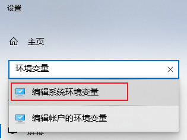
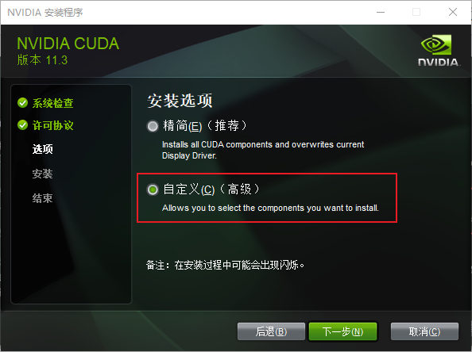
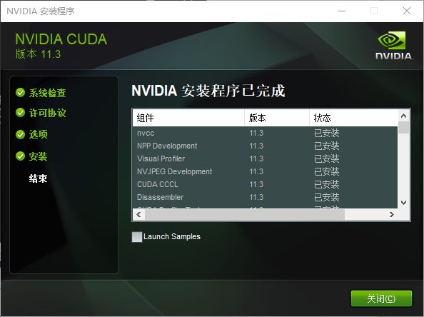
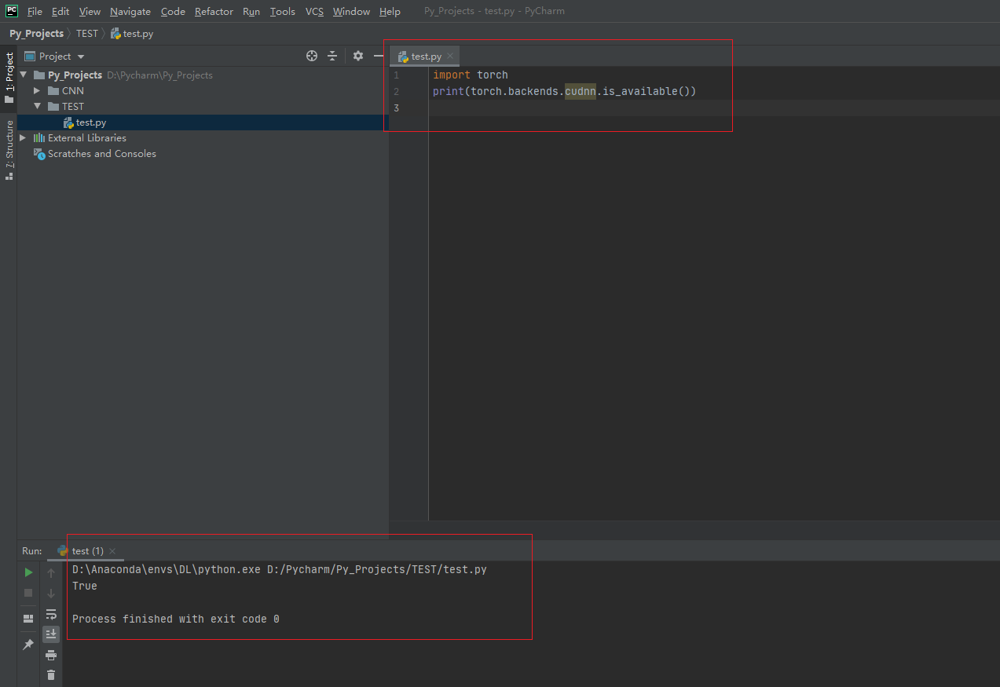
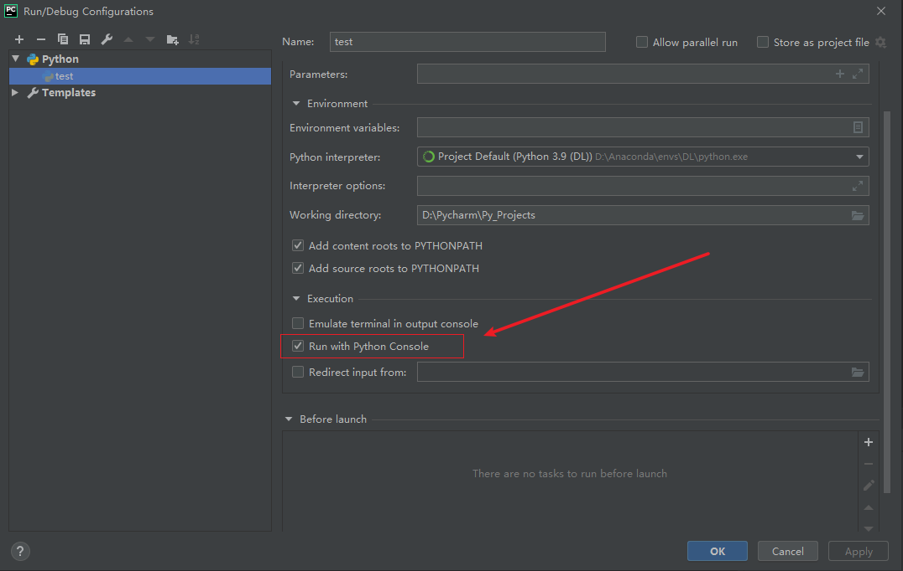

> 
> 参考视频：https://www.bilibili.com/video/BV1cD4y1H7Tk
> 


### 确认电脑配置

> 
> > <div align=center>
> > 
> > 
> > 
> > </div> 
> >  
>
> `RTX 3070`的`驱动`版本为`516.94`，`显卡内 CUDA`版本为 `11.7.101`
>
> 选择`CUDA Toolkit`时，需要保证驱动版本对应
>
> https://docs.nvidia.com/cuda/cuda-toolkit-release-notes/index.html
>
> > <div align=center>
> > 
> > </div> 
> >  
>
> <font color="yellow">
> 
> * `NVIDIA` 显卡中的运算平台是 `CUDA`，不过，即使您的计算机有 `NVIDIA` 显卡，但您的显卡中也不一定含有 `CUDA`，没有的话就要下载 `CUDA`。
> 
> * 而 `PyTorch` 的下载组件里也会包含一个内置的 `cuda`。
> 
> 为了区分，显卡内的 `CUDA` 用大写，`PyTorch` 内置的 `cuda` 用小写。
>
> 一般来讲，要满足：`CUDA 版本 ≥ cuda 版本`。
> 
> </font> 
> 
> 查看 `CUDA` 版本的方法是：`Win+R` 后输入 `cmd`，进入命令提示符，我们需要输入 `nvcc -V`，如图
> 
> > <div align=center>
> > 
> > </div> 
> >  
> > 显示“`nvcc -V 不是内部或外部命令`”，则说明需要安装 `CUDA`。
> 
> <font color="gree">后面我们将安装 `torch 1.12.0` 版本，其可选的内置 `cuda` 版本是 `11.3`。因此，如果您显卡里的 CUDA 低于了 `11.3`，需要进行升级。</font> 
>
> 


### 一. 下载

#### 1.1 下载Anaconda

> 
> 官网下载anaconda太慢了：https://www.anaconda.com/
>
> 清华源下载anaconda：https://mirrors.tuna.tsinghua.edu.cn/anaconda/archive/
>
> > 
> > <div align=center>
> > 
> > </div> 
> >  
> 
> 
> 
> 


#### 1.2 下载CUDA

> 
> 官网下载：https://developer.nvidia.com/cuda-toolkit-archive
>
>
> > 
> > <div align=center>
> > 
> > 
> > </div> 
> >  
> 
> 
> 


#### 1.3 下载torch、torchaudio、torchvision（后续不使用命令安装Pytorch GPU版）

> 
> 官网：https://download.pytorch.org/whl/
> 
> <div align=center>
> 
> </div> 
>
> 
> > <font color="gree">torch下载</font>：https://download.pytorch.org/whl/torch/
> > 
> > <div align=center>
> > 
> > </div> 
> >  
>
>
> 
> > <font color="gree">torchaudio下载</font>：https://download.pytorch.org/whl/torchaudio/
> > 
> > <div align=center>
> > 
> > </div> 
> >  
> 
> > <font color="gree">torchvision下载</font>：https://download.pytorch.org/whl/torchaudio/
> > 
> > <div align=center>
> > 
> > </div> 
> >  
>
>


#### 1.4 下载pycharm


> 
> 官网：https://www.jetbrains.com/pycharm/download/other.html
> 
> <div align=center>
> 
> </div> 
>
> 
>
> 


#### 1.5 总结

> 
> <div align=center>
> 
> </div> 
>
> 


### 二. 安装Anaconda


#### 2.1 执行安装包

> 
> <div align=center>
> 
> 
> 
> 
> 
> 
> 
>  
>  
> </div> 
> 
> 进度条会停在约 90% 的位置共 3 分钟
>


#### 2.2 配置环境变量

> 
> <div align=center>
> 
> 
>  
> 
> 
> </div> 
> 
> 
> > 确定后重新进入查看，是否添加成功
> >  
> > 如果后续出问题，还可以加入"`D:\Anaconda\Library\usr\bin`"和"`D:\Anaconda\Library\mingw-w64\bin`"
> > 
>

#### 2.3 添加桌面快捷方式


> <div align=center>
> 
> 
> </div> 
> 
> 
> 


#### 2.4 验证安装是否成功

>
> <font color="gree">2.4.1 点击Prompt，进入Anaconda环境 </font> 
> 
> > <div align=center>
> > 
> > </div> 
> > 
> > 验证安装是否成功
> > 
> > ```sh
> > $ conda --version
> > 
> > $ conda info
> > 
> > $ python
> > 
> > $ exit()
> > ```
> > 
> > <div align=center>
> > 
> > </div> 
> 
> 

#### 2.5 Anaconda换源 (没做)


> <font color="gree">换源 (没做) </font> 
> 
> > 
> > 参考：https://blog.csdn.net/weixin_43871064/article/details/106895426
> > 
> > ```sh
> > conda config --show channels # 查看当前通道
> > 
> > conda config --add channels https://mirrors.tuna.tsinghua.edu.cn/anaconda/pkgs/free/
> > 
> > conda config --add channels https://mirrors.tuna.tsinghua.edu.cn/anaconda/pkgs/main/
> > 
> > conda config --set show_channel_urls yes 
> > 
> > conda config --show channels # 查看是否修改好通道？
> > 
> > conda clean -i # 清除索引缓存，保证用的是镜像站提供的索引。
> > ```
> > 
> > 


#### 2.6 Anaconda常用命令

> <font color="gree">常用命令 </font> 
> 
> > 
> > ```sh
> > # 清屏
> > cls 
> > ```
> > 
> > `base` 环境下的操作
> > 
> > ```sh
> > # 列出所有的环境
> > conda env list
> > 
> > # 创建名为“环境名”的虚拟环境，并指定 Python 的版本
> > conda create -n 环境名 python=3.9
> > 
> > # 创建名为“环境名”的虚拟环境，并指定 Python 的版本与安装路径
> > conda create --prefix=安装路径\环境名 python=3.9
> > 
> > # 删除名为“环境名”的虚拟环境
> > conda remove -n 环境名 --all
> > 
> > # 进入名为“环境名”的虚拟环境
> > conda activate 环境名
> > ```
> > 
> > 虚拟环境内的操作
> > 
> > ```sh
> > # 列出当前环境下的所有库
> > conda list
> > 
> > # 安装 NumPy 库，并指定版本 1.21.5
> > pip install numpy==1.21.5 -i https://pypi.tuna.tsinghua.edu.cn/simpl
> > 
> > # 安装 Pandas 库，并指定版本 1.2.4
> > pip install Pandas==1.2.4 -i https://pypi.tuna.tsinghua.edu.cn/simple
> > 
> > # 安装 Matplotlib 库，并指定版本 3.5.1
> > pip install Matplotlib==3.5.1 -i https://pypi.tuna.tsinghua.edu.cn/simple
> > 
> > # 查看当前环境下某个库的版本（以 numpy 为例）
> > pip show numpy
> > 
> > # 退出虚拟环境
> > conda deactivate
> > ```
> > 
>
> 
> 


### 三. 安装PyTorch库 (GPU版)


#### 3.1 GPU基础

> 
> > <div align=center>
> > 
> > 
> > 
> > </div> 
> >  
>
> `RTX 3070`的`驱动`版本为`516.94`，`显卡内 CUDA`版本为 `11.7.101`
>
> 选择`CUDA Toolkit`时，需要保证驱动版本对应
>
> https://docs.nvidia.com/cuda/cuda-toolkit-release-notes/index.html
>
> > <div align=center>
> > 
> > </div> 
> >  
>
> <font color="yellow">
> 
> * `NVIDIA` 显卡中的运算平台是 `CUDA`，不过，即使您的计算机有 `NVIDIA` 显卡，但您的显卡中也不一定含有 `CUDA`，没有的话就要下载 `CUDA`。
> 
> * 而 `PyTorch` 的下载组件里也会包含一个内置的 `cuda`。
> 
> 为了区分，显卡内的 `CUDA` 用大写，`PyTorch` 内置的 `cuda` 用小写。
>
> 一般来讲，要满足：`CUDA 版本 ≥ cuda 版本`。
> 
> </font> 
> 
> 查看 `CUDA` 版本的方法是：`Win+R` 后输入 `cmd`，进入命令提示符，我们需要输入 `nvcc -V`，如图
> 
> > <div align=center>
> > 
> > </div> 
> >  
> > 显示“`nvcc -V 不是内部或外部命令`”，则说明需要安装 `CUDA`。
> 
> 

#### 3.2 安装显卡内CUDA

> <font color="gree">运行安装包（压缩包）</font> 
> 
> > <div align=center>
> > 
> > </div> 
> 
> <font color="gree">弹出界面，选择解压位置`D:\CUDA`</font> 
> 
> > <div align=center>
> > 
> > 
> > </div> 
> 
> <font color="gree">解压好之后会弹出安装界面</font> 
> 
> > <div align=center>
> > 
> > 
> > 
> > 
> > 
> > 
> > 
> > 
> > 
> > </div> 
> > 
> > The following information only pertains to Nsight Visual Studio features and does not describe CuDA toolkit install status.
> > 
> > 以下信息仅涉及 Nsight Visual Studio 功能，并不描述 CuDA 工具包安装状态。
> > 
> 
> <font color="gree">现在回头查看临时解压文件夹 D:\CUDA，会发现已经消失。</font> 
> 
> <font color="gree">接下来配置环境变量（参考 2.2 小节的打开方式），如果你是按照默认路径
的话，其路径应该是：</font> 
> 
> > ```
> > C:\Program Files\NVIDIA GPU Computing Toolkit\CUDA
> > C:\Program Files\NVIDIA GPU Computing Toolkit\CUDA\v11.3\lib\x64
> > C:\Program Files\NVIDIA GPU Computing Toolkit\CUDA\v11.3\bin
> > C:\Program Files\NVIDIA GPU Computing Toolkit\CUDA\v11.3\libnvvp
> > ```
> 
> <font color="gree">但是我打开后发现，已经自动配置好了一些环境变量</font> 
> 
> > <div align=center>
> > 
> > </div> 
> 
> <font color="gree">我们再添加剩下的</font> 
> 
> > <div align=center>
> > 
> > </div> 
> 
> 
> 
> <font color="gree">最后，回头检查一下 `CUDA` 版本，`Win+R` 后输入 `cmd`，进入命令提示符，输入 `nvcc -V`，如图所示。</font> 
> 
> > <div align=center>
> > 
> > </div> 
> 
> 
> <font color="yellow">注意，尽管您输入 `nvidia-smi` 可能仍然显示老版本，但经查阅资料，`CUDA`的实际使用版本以 `nvcc -V` 中的 `CUDA` 版本为准</font> 
> 
> 
> 
> 


#### 3.3 安装显卡内 CUDA 的 cuDNN 加速库（非必要, 没做）

> 
> 官方下载地址：https://developer.nvidia.com/rdp/cudnn-archive
> 
> `cuDNN` 的全称为 `NVIDIA CUDA® Deep Neural Network library`，是 `NVIDIA` 专门针对深度神经网络（`Deep Neural Networks`）中的基础操作而设计基于 `GPU` 的加速库
> 
>
> <font color="yellow">如果您是通过特定的深度学习框架安装的（如 `TensorFlow` 或 `PyTorch` 的某些版本），`cuDNN` 可能会被包含在框架的安装包中，而不需要单独安装。在这种情况下，`cuDNN` 会被安装在框架的目录结构中，而不是在 `CUDA Toolkit` 的目录下。</font> 
> 
> 


#### 3.4 创建虚拟环境

> 
> 
> 
> ```sh
> # 列出所有的环境
> conda env list
> 
> # 创建名为“DL”的虚拟环境，并指定 Python 的版本
> conda create -n DL python=3.9
> 
> # 查看是否创建成功
> conda env list
> 
> # 进入名为“DL”的虚拟环境
> conda activate DL
> ```
> 
> > 
> > 虚拟环境内的操作
> > 
> > ```sh
> > # 列出当前环境下的所有库
> > conda list
> > 
> > # 安装 NumPy 库，并指定版本 1.21.5
> > pip install numpy==1.21.5 -i https://pypi.tuna.tsinghua.edu.cn/simple
> > 
> > # 安装 Pandas 库，并指定版本 1.2.4
> > pip install Pandas==1.2.4 -i https://pypi.tuna.tsinghua.edu.cn/simple
> > 
> > # 安装 Matplotlib 库，并指定版本 3.5.1
> > pip install Matplotlib==3.5.1 -i https://pypi.tuna.tsinghua.edu.cn/simple
> > 
> > # 查看当前环境下某个库的版本（以 numpy 为例）
> > pip show numpy
> > 
> > # 退出虚拟环境
> > conda deactivate
> > ```
> > 
> 
> 


#### 3.5 安装Pytorch（GPU版）
> 说明如下：
> 
> > `PyTorch` 一分为三：`torch`、`torchvision` 与 `torchaudio`。
> > 
> > 这三个库中，`torch` 有 `2G` 左右，而 `torchvision` 和 `torchaudio` 只有 `2M` 左右，因此一般在代码里只会 `import torch`。
> > 
> > 当 `torch` 的版本给定后，另外两个附件的版本也唯一确定了。
> > 
> > 安装 `torch` 前，先给出一张安装表，其中 `cu113` 即 `cuda 11.3`，`cp39` 即 `Python` 解释器的版本是 `Python3.9`。注：`NVIDIA` 显卡 `30` 系列（如 `NVIDIA GeForce RTX 3050`）只能安装 `cu110` 及其以后的版本。
> > 
> > 
> > <div align=center>
> > 
> > </div> 
> > 
> > 根据表 5-1，`torch 1.12.0` 支持的 `cuda` 是 `11.3` 或 `11.6`，任意选一个即可；其支持的 `Python` 是 `3.7 - 3.10`，刚刚新建的虚拟环境的 `Python` 是 `3.9`，满足条件。
> > 
> > <font color="pink">由于`显卡内 CUDA`为`11.3`，`torch cuda`不能选更高的版本，这里只能`cuda 11.3`</font> 
> > 
> > 
> 
> https://pytorch.org/get-started/previous-versions/
> 
> 
> > <div align=center>
> > 
> > 
> > </div> 
> 
> 
> <font color="gree">请注意，这里使用 `pip` 安装，而不是 `conda` 安装（如果用 `conda` 安装，最后检验 `cuda` 时是不可用的）</font> 
>
> 
> 
> <font color="yellow">（1）方法一：直接安装（不建议，网差的话会死机）</font> 
> 
> > ```sh
> > # 列出所有的环境
> > conda env list
> > 
> > # 进入名为“DL”的虚拟环境
> > conda activate DL
> > ```
> > 
> > 
> > 虚拟环境内的操作
> > 
> > ```sh
> > # 列出当前环境下的所有库
> > conda list
> > 
> > # 安装torch v1.12.0 CUDA 11.3 版 
> > pip install torch==1.12.0+cu113 torchvision==0.13.0+cu113 torchaudio==0.12.0 --extra-index-url https://download.pytorch.org/whl/cu113
> > 
> > # 退出虚拟环境
> > conda deactivate
> > ```
> > 
> > 看到最后几行代码里有 `Successfully installed` 就算成功。
> > 
> > 安装命令的意思是，使用 `pip` 安装三个库，
> > 
> > 第一库是 `torch==1.12.0+cu113`，
> > 
> > 第二个库是 `torchvision==0.13.0+cu113`，
> > 
> > 第三个库是 `torchaudio==0.12.0`，
> > 
> > 库的下载地址是 https://download.pytorch.org/whl/cu113。
> > 
>
> 
> 
> <font color="yellow">（2）方法二：先下whl文件（wheel 轮子）再安装 </font> 
>
> 
> > <div align=center>
> > 
> > </div> 
> > 
> > 下载好后，将三个 `whl` 文件放在新建的 `D:\whl` 文件夹中（安装完不要删，建议留着，之后可能还要安装）。
> > 
> > <div align=center>
> > 
> > </div> 
> > 
> > 安装命令为 `pip install 路径\轮子名.whl`，即
> > 
> > ```sh
> > pip install D:\whl\torch-1.12.0+cu113-cp39-cp39-win_amd64.whl
> > 
> > pip install D:\whl\torchaudio-0.12.0+cu113-cp39-cp39-win_amd64.whl
> > 
> > pip install D:\whl\torchvision-0.13.0+cu113-cp39-cp39-win_amd64.whl
> > ```
> > 
> > <font color="gree">进入虚拟环境</font> 
> > 
> > ```sh
> > # 列出所有的环境
> > conda env list
> > 
> > # 进入名为“DL”的虚拟环境
> > conda activate DL
> > ```
> > 
> > 
> > <font color="gree">虚拟环境内的操作</font> 
> > 
> > ```sh
> > # 列出当前环境下的所有库
> > conda list
> > 
> > # 安装torch v1.12.0 CUDA 11.3 版 
> > pip install D:\whl\torch-1.12.0+cu113-cp39-cp39-win_amd64.whl
> > pip install D:\whl\torchaudio-0.12.0+cu113-cp39-cp39-win_amd64.whl
> > pip install D:\whl\torchvision-0.13.0+cu113-cp39-cp39-win_amd64.whl
> > 
> > # 退出虚拟环境
> > conda deactivate
> > ```
> > 
> > 
> > <div align=center>
> > 
> > </div> 
> >  
>
> 
> 

#### 3.6 检验 cuda 是否可用


> 
> 
> <font color="yellow"> 方法一：查看当前环境的所有库 </font> 
>
> > 进入 DL 环境后，使用 `conda list` 命令列出当前的所有库，如图。
> > 
> > <div align=center>
> > 
> > </div> 
> >  
> 
> 
> <font color="yellow"> 方法二：进入 Python 解释器检验 </font> 
>
> > 
> > <font color="gree">虚拟环境内的操作</font> 
> > 
> > ```sh
> > # 输入 python 以进入解释器
> > python
> > 
> > # 输入 import torch 导入 torch 库
> > import torch
> > # 若 torch 安装失败，则会返回 No module named ‘torch’。
> > # 若安装成功，不会返回任何语句，同时在下一行出现“>>>”，提示我们可以继续敲代码。
> > 
> > # 输入 torch.cuda.is_available()
> > torch.cuda.is_available()
> > ```
> > 
> > <div align=center>
> > 
> > </div> 
> >  
> 
> 
> <font color="yellow"> 方法三：虚拟环境连接 Jupyter 执行以下命令 </font> 
> 
> > 
> > ```sh
> > import torch
> > 
> > torch.cuda.is_available()
> > ```
> > 
> 
> <font color="yellow"> 方法四：虚拟环境连接 PyCharm 执行上述命令 </font> 
> 
> > 
> > ```sh
> > import torch
> > 
> > torch.cuda.is_available()
> > ```
> > 
> 
> 
> 


#### 3.7 检查cuDNN是否被安装在了Pytorch深度学习框架中

> 
>
> <font color="yellow">如果您是通过特定的深度学习框架安装的（如 `TensorFlow` 或 `PyTorch` 的某些版本），`cuDNN` 可能会被包含在框架的安装包中，而不需要单独安装。在这种情况下，`cuDNN` 会被安装在框架的目录结构中，而不是在 `CUDA Toolkit` 的目录下。</font> 
>
> > 
> > <div align=center>
> > 
> > </div> 
> >  
> 
> ```sh
> import torch
> 
> print(torch.backends.cudnn.is_available())
> ```
>
> > 
> > <div align=center>
> > 
> > </div> 
> >  
> 
> 


### 四. Jupyter 代码编辑器


> 
> 前提：计算机用户名为英文，我的是"`zqc`"
> 
> 
> 
> <font color="gree"> 1. 修改工作路径 </font>
> 
> > `Jupyter` 初始的工作路径为`【C:\Users\用户名】`，需要进行修正，将其转移到新建的`【D:\Jupyter】`位置。
> > 
> > ① 新建 `D:\Jupyter`；
> > 
> > <div align=center>
> > 
> > </div> 
> >   
> > ② 打开桌面快捷方式中的 Anaconda Prompt (Anaconda)；
> > 
> > ③ 输入 `jupyter notebook --generate-config` 命令并执行；
> > 
> > <div align=center>
> > 
> > </div> 
> >   
> > ④ 打开上一步生成的配置文件地址，即`C:\Users\zqc\.jupyter`
> > 
> > <div align=center>
> > 
> > </div> 
> > 
> > ⑤ 在 `jupyter_notebook_config.py`（以记事本方式打开）中使用 `Ctrl + F` 查找
并且修改如下配置项：
> > 
> > ```html
> > 修改前：# c.NotebookApp.notebook_dir = ''
> > 
> > 修改后：c.NotebookApp.notebook_dir = 'D:\Jupyter'
> > ```
> > 
> > > 也即删除前面的`#`号注释，在后面的单引号里输入要设置的目录路径，注意，
`'D:\Jupyter'` 中不能有空格，否则 `Jupyter` 打开就闪退。保存后关闭。
> > 
> > <div align=center>
> > 
> > 
> > </div> 
> > 
> > 
> > ⑥ 找到桌面的 jupyter notebook 快捷图标，鼠标右键>>属性>>快捷方式>>目标，删除最后的`"%USERPROFILE%/"`。
> > 
> > <div align=center>
> > 
> > </div> 
> >  
>
> <font color="yellow"> 这样，以后每次在 `D:\Jupyter` 进行修改，都会同步显示在 `Jupyter` 中 </font>
> 
> > 
> > <div align=center>
> > 
> > </div> 
> >  
>
> 
> 
> <font color="gree"> 2. 修改默认字体 </font>
>  
> > ① 打开如下地址
> > 
> > ```html
> > D:\Anaconda\Lib\site-packages\notebook\static\components\codemirror\lib
> > ```
> > 
> > <div align=center>
> > 
> > </div> 
> >  
> > ② 打开 `codemirror.css`` 文件；
> > 
> > 默认字体为`monospace`, 我们进行修改
> > 
> > ③ Ctrl+F，搜索“`font-family: monospace;`”的文字，并将其改为
> > 
> > ```html
> > font-family: 'Fira Code Light','Consolas';
> > ```
> > 
> 
> 
> <font color="gree"> 3. 虚拟环境连接 Jupyter </font>
>  
> > <div align=center>
> > 
> > </div> 
> > 
> > 我们已经在 `Anaconda` 里创建了一个叫 `DL` 的虚拟环境，但是现在这个叫 `DL` 的虚拟环境没有连接 `Jupyter`，换句话说，`Jupyter` 现在仅仅能与 `base`` 环境相连。
> > 
> > 为让虚拟环境与 `Jupyter` 相连，请在 `Anaconda Prompt` 的虚拟环境下操作下列命令。
> > 
> > ```sh
> > # 安装 ipykernel
> > pip install ipykernel -i https://pypi.tuna.tsinghua.edu.cn/simple
> > 
> > # 将虚拟环境导入 Jupyter 的 kernel 中
> > python -m ipykernel install --user --name=环境名
> > 
> > # 删除虚拟环境的 kernel 内核
> > jupyter kernelspec remove 环境名
> > ```
> > 
> > 实际操作如下
> > 
> > ```sh
> > # 进入名为“DL”的虚拟环境
> > conda activate DL
> > 
> > # 安装 ipykernel
> > pip install ipykernel -i https://pypi.tuna.tsinghua.edu.cn/simple
> > 
> > # 将虚拟环境 DL 导入 Jupyter 的 kernel 中
> > python -m ipykernel install --user --name=DL
> > 
> > # 退出虚拟环境
> > conda deactivate
> > ```
> > 
> > <div align=center>
> > 
> > 
> > </div> 
> > 
>
> <font color="yellow"> 
> 
> 我们使用 `New` 创建的脚本后缀为 `.ipynb`，全称 `.ipython notebook`，即 `.Jupyter Notebook`
>
> 相对于 `.py`，唯一的区别是 `.ipynb` 可以对代码进行分块
>
> 我们在 `Jupyter` 中可以对代码块进行剪辑
>
> </font>
> 
> 


#### 如果闪退咋么办

>
> https://blog.csdn.net/xiaobin_23134/article/details/133499644
>
> https://github.com/microsoft/azuredatastudio/issues/24436
>
> ```sh
> pip uninstall traitlets
> 
> pip install traitlets==5.9.0
> ```
> 


### 五. 安装 PyCharm

>
> 1. 安装
> 
> > <div align=center>
> > 
> > 
> > 
> > 
> >  
> > </div> 
> 
> 
> 2. 虚拟环境连接 PyCharm
> 
> > 
> > 首先在 `D:\PyCharm` 中创建文件夹 `Py_Projects` 存放工程。
> > 
> > <div align=center>
> > 
> > </div> 
> > 
> > 接着，在 PyCharm 里创建新工程，如图所示。
> > 
> > <div align=center>
> > 
> > </div> 
> > 
> > 第一步，切换新工程的位置为刚刚创建的文件夹；
> > 
> > 第二步，点击“`Existing interpreter`”；
> > 
> > 第三步，由于是第一次进入 PyCharm，只能点击“`…`”来找解释器。
> > 
> > <div align=center>
> > 
> > </div> 
> > 
> > 在弹出的界面中，首先点击左侧的 conda 环境，再将解释器设置为 Anaconda 虚拟环境解释器的地址，如图所示
> > 
> > <div align=center>
> > 
> > 
> > </div> 
> > 
> > 第一次进入工程页面，连接 Anaconda 需要一段时间（3 分钟是有的），点击右下角蓝色小圈圈可查看进度，如图所示。
> > 
> > <div align=center>
> > 
> > </div> 
> > 
> > 更新好之后，我们可以把 PyCharm 设置为中文。File——Settings——Plugins
> > 
> > 在搜索框输入 Chinese——安装第二个。
> > 
> > <div align=center>
> > 
> > </div> 
> > 
> > 下载好后，点击 Restart IDE，即重启 PyCharm，重启后，会发现软件已经变成了简体中文，但要第二次更新配置，但这一次更新速度会极快。
> > 
> > <font color="yellow"> 版本低的IDE可能会无法安装汉化包</font>
> > 
> > 现在，在此工程里创建一个名为“test”的 `.py` 文件，如图所示。
> > 
> > 
> > <div align=center>
> > 
> > </div> 
> > 
> > 
> > 点击 编辑配置`Edit Configurations`,勾选 “使用 Python 控制台运行” `Run with Python Console`，并应用`Apply`
> > 
> > <div align=center>
> > 
> > 
> > </div> 
> > 
> > `Ctrl+Shift+F10` 运行`.py` 文件，控制台右侧即可显示每个变量的数值。
> > 
> > <div align=center>
> > 
> > </div> 
> > 
> > 
> 


