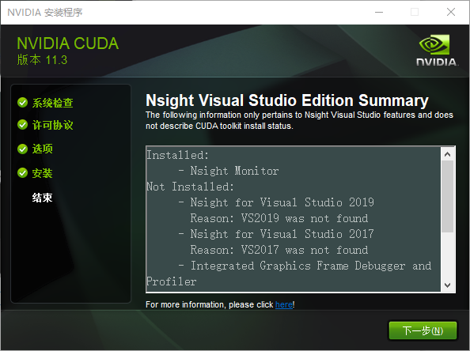

> 
> 参考视频：https://www.bilibili.com/video/BV1cD4y1H7Tk
> 


### 确认电脑配置

> 
> > <div align=center>
> > 
> > 
> > 
> > </div> 
> >  
>
> `RTX 3070`的`驱动`版本为`516.94`，`显卡内 CUDA`版本为 `11.7.101`
>
> 选择`CUDA Toolkit`时，需要保证驱动版本对应
>
> https://docs.nvidia.com/cuda/cuda-toolkit-release-notes/index.html
>
> > <div align=center>
> > 
> > </div> 
> >  
>
> <font color="yellow">
> 
> * `NVIDIA` 显卡中的运算平台是 `CUDA`，不过，即使您的计算机有 `NVIDIA` 显卡，但您的显卡中也不一定含有 `CUDA`，没有的话就要下载 `CUDA`。
> 
> * 而 `PyTorch` 的下载组件里也会包含一个内置的 `cuda`。
> 
> 为了区分，显卡内的 `CUDA` 用大写，`PyTorch` 内置的 `cuda` 用小写。
>
> 一般来讲，要满足：`CUDA 版本 ≥ cuda 版本`。
> 
> </font> 
> 
> 查看 `CUDA` 版本的方法是：`Win+R` 后输入 `cmd`，进入命令提示符，我们需要输入 `nvcc -V`，如图
> 
> > <div align=center>
> > 
> > </div> 
> >  
> > 显示“`nvcc -V 不是内部或外部命令`”，则说明需要安装 `CUDA`。
> 
> <font color="gree">后面我们将安装 `torch 1.12.0` 版本，其可选的内置 `cuda` 版本是 `11.3`。因此，如果您显卡里的 CUDA 低于了 `11.3`，需要进行升级。</font> 
>
> 


### 一. 下载

#### 1.1 下载Anaconda

> 
> 官网下载anaconda太慢了：https://www.anaconda.com/
>
> 清华源下载anaconda：https://mirrors.tuna.tsinghua.edu.cn/anaconda/archive/
>
> > 
> > <div align=center>
> > 
> > </div> 
> >  
> 
> 
> 
> 


#### 1.2 下载CUDA

> 
> 官网下载：https://developer.nvidia.com/cuda-toolkit-archive
>
>
> > 
> > <div align=center>
> > 
> > 
> > </div> 
> >  
> 
> 
> 


#### 1.3 下载torch、torchaudio、torchvision

> 
> 官网：https://download.pytorch.org/whl/
> 
> <div align=center>
> 
> </div> 
>
> 
> > <font color="gree">torch下载</font>：https://download.pytorch.org/whl/torch/
> > 
> > <div align=center>
> > 
> > </div> 
> >  
>
>
> 
> > <font color="gree">torchaudio下载</font>：https://download.pytorch.org/whl/torchaudio/
> > 
> > <div align=center>
> > 
> > </div> 
> >  
> 
> > <font color="gree">torchvision下载</font>：https://download.pytorch.org/whl/torchaudio/
> > 
> > <div align=center>
> > 
> > </div> 
> >  
>
>


#### 1.4 下载pycharm


> 
> 官网：https://www.jetbrains.com/pycharm/download/other.html
> 
> <div align=center>
> 
> </div> 
>
> 
>
> 


#### 1.5 总结

> 
> <div align=center>
> 
> </div> 
>
> 


### 二. 安装Anaconda


#### 2.1 执行安装包

> 
> <div align=center>
> 
> 
> 
> 
> 
> 
> 
>  
>  
> </div> 
> 
> 进度条会停在约 90% 的位置共 3 分钟
>


#### 2.2 配置环境变量

> 
> <div align=center>
> 
> 
>  
> 
> 
> </div> 
> 
> 
> > 确定后重新进入查看，是否添加成功
> >  
> > 如果后续出问题，还可以加入"`D:\Anaconda\Library\usr\bin`"和"`D:\Anaconda\Library\mingw-w64\bin`"
> > 
>

#### 2.3 添加桌面快捷方式


> <div align=center>
> 
> 
> </div> 
> 
> 
> 


#### 2.4 验证安装是否成功

>
> <font color="gree">2.4.1 点击Prompt，进入Anaconda环境 </font> 
> 
> > <div align=center>
> > 
> > </div> 
> > 
> > 验证安装是否成功
> > 
> > ```sh
> > $ conda --version
> > 
> > $ conda info
> > 
> > $ python
> > 
> > $ exit()
> > ```
> > 
> > <div align=center>
> > 
> > </div> 
> 
> 

#### 2.5 Anaconda换源 (没做)


> <font color="gree">换源 (没做) </font> 
> 
> > 
> > 参考：https://blog.csdn.net/weixin_43871064/article/details/106895426
> > 
> > ```sh
> > conda config --show channels # 查看当前通道
> > 
> > conda config --add channels https://mirrors.tuna.tsinghua.edu.cn/anaconda/pkgs/free/
> > 
> > conda config --add channels https://mirrors.tuna.tsinghua.edu.cn/anaconda/pkgs/main/
> > 
> > conda config --set show_channel_urls yes 
> > 
> > conda config --show channels # 查看是否修改好通道？
> > 
> > conda clean -i # 清除索引缓存，保证用的是镜像站提供的索引。
> > ```
> > 
> > 


#### 2.6 Anaconda常用命令

> <font color="gree">常用命令 </font> 
> 
> > 
> > ```sh
> > # 清屏
> > cls 
> > ```
> > 
> > `base` 环境下的操作
> > 
> > ```sh
> > # 列出所有的环境
> > conda env list
> > 
> > # 创建名为“环境名”的虚拟环境，并指定 Python 的版本
> > conda create -n 环境名 python=3.9
> > 
> > # 创建名为“环境名”的虚拟环境，并指定 Python 的版本与安装路径
> > conda create --prefix=安装路径\环境名 python=3.9
> > 
> > # 删除名为“环境名”的虚拟环境
> > conda remove -n 环境名 --all
> > 
> > # 进入名为“环境名”的虚拟环境
> > conda activate 环境名
> > ```
> > 
> > 虚拟环境内的操作
> > 
> > ```sh
> > # 列出当前环境下的所有库
> > conda list
> > 
> > # 安装 NumPy 库，并指定版本 1.21.5
> > pip install numpy==1.21.5 -i https://pypi.tuna.tsinghua.edu.cn/simpl
> > 
> > # 安装 Pandas 库，并指定版本 1.2.4
> > pip install Pandas==1.2.4 -i https://pypi.tuna.tsinghua.edu.cn/simple
> > 
> > # 安装 Matplotlib 库，并指定版本 3.5.1
> > pip install Matplotlib==3.5.1 -i https://pypi.tuna.tsinghua.edu.cn/simple
> > 
> > # 查看当前环境下某个库的版本（以 numpy 为例）
> > pip show numpy
> > 
> > # 退出虚拟环境
> > conda deactivate
> > ```
> > 
>
> 
> 


### 三. 安装PyTorch库 (GPU版)


#### 3.1 GPU基础

> 
> > <div align=center>
> > 
> > 
> > 
> > </div> 
> >  
>
> `RTX 3070`的`驱动`版本为`516.94`，`显卡内 CUDA`版本为 `11.7.101`
>
> 选择`CUDA Toolkit`时，需要保证驱动版本对应
>
> https://docs.nvidia.com/cuda/cuda-toolkit-release-notes/index.html
>
> > <div align=center>
> > 
> > </div> 
> >  
>
> <font color="yellow">
> 
> * `NVIDIA` 显卡中的运算平台是 `CUDA`，不过，即使您的计算机有 `NVIDIA` 显卡，但您的显卡中也不一定含有 `CUDA`，没有的话就要下载 `CUDA`。
> 
> * 而 `PyTorch` 的下载组件里也会包含一个内置的 `cuda`。
> 
> 为了区分，显卡内的 `CUDA` 用大写，`PyTorch` 内置的 `cuda` 用小写。
>
> 一般来讲，要满足：`CUDA 版本 ≥ cuda 版本`。
> 
> </font> 
> 
> 查看 `CUDA` 版本的方法是：`Win+R` 后输入 `cmd`，进入命令提示符，我们需要输入 `nvcc -V`，如图
> 
> > <div align=center>
> > 
> > </div> 
> >  
> > 显示“`nvcc -V 不是内部或外部命令`”，则说明需要安装 `CUDA`。
> 
> 

#### 3.2 安装显卡内CUDA

> <font color="gree">运行安装包（压缩包）</font> 
> 
> > <div align=center>
> > 
> > </div> 
> 
> <font color="gree">弹出界面，选择解压位置`D:\CUDA`</font> 
> 
> > <div align=center>
> > 
> > 
> > </div> 
> 
> <font color="gree">解压好之后会弹出安装界面</font> 
> 
> > <div align=center>
> > 
> > 
> > 
> > 
> > 
> > 
> > 
> > 
> > 
> > </div> 
> > 
> > The following information only pertains to Nsight Visual Studio features and does not describe CuDA toolkit install status.
> > 
> > 以下信息仅涉及 Nsight Visual Studio 功能，并不描述 CuDA 工具包安装状态。
> > 
> 
> <font color="gree">现在回头查看临时解压文件夹 D:\CUDA，会发现已经消失。</font> 
> 
> <font color="gree">接下来配置环境变量（参考 2.2 小节的打开方式），如果你是按照默认路径
的话，其路径应该是：</font> 
> 
> > ```
> > C:\Program Files\NVIDIA GPU Computing Toolkit\CUDA
> > C:\Program Files\NVIDIA GPU Computing Toolkit\CUDA\v11.3\lib\x64
> > C:\Program Files\NVIDIA GPU Computing Toolkit\CUDA\v11.3\bin
> > C:\Program Files\NVIDIA GPU Computing Toolkit\CUDA\v11.3\libnvvp
> > ```
> 
> <font color="gree">但是我打开后发现，已经自动配置好了一些环境变量</font> 
> 
> > <div align=center>
> > 
> > </div> 
> 
> <font color="gree">我们再添加剩下的</font> 
> 
> > <div align=center>
> > 
> > </div> 
> 
> 
> 
> <font color="gree">最后，回头检查一下 `CUDA` 版本，`Win+R` 后输入 `cmd`，进入命令提示符，输入 `nvcc -V`，如图所示。</font> 
> 
> > <div align=center>
> > 
> > </div> 
> 
> 
> <font color="yellow">注意，尽管您输入 `nvidia-smi` 可能仍然显示老版本，但经查阅资料，`CUDA`的实际使用版本以 `nvcc -V` 中的 `CUDA` 版本为准</font> 
> 
> 
> 
> 


#### 3.3 创建虚拟环境

> 
> 
> 
> 
> 
> 


#### 3.4 安装Pytorch（GPU版）

> 
> > `PyTorch` 一分为三：`torch`、`torchvision` 与 `torchaudio`。
> > 
> > 这三个库中，`torch` 有 `2G` 左右，而 `torchvision` 和 `torchaudio` 只有 `2M` 左右，因此一般在代码里只会 `import torch`。
> > 
> > 当 `torch` 的版本给定后，另外两个附件的版本也唯一确定了。
> > 
> > 安装 `torch` 前，先给出一张安装表，其中 `cu113` 即 `cuda 11.3`，`cp39` 即 `Python` 解释器的版本是 `Python3.9`。注：`NVIDIA` 显卡 `30` 系列（如 `NVIDIA GeForce RTX 3050`）只能安装 `cu110` 及其以后的版本。
> > 
> 
> > <div align=center>
> > 
> > </div> 
> 
> 
> 
> 
> 
> 
> 


