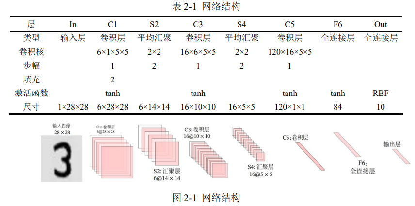

### 深度学习的相关库、基本常识

> 
> <div align=center>
> 
> </div> 
> 
> ① NumPy 包为 Python 加上了关键的数组变量类型，弥补了 Python 的不足；
> ② Pandas 包在 NumPy 数组的基础上添加了与 Excel 类似的行列标签；
> ③ Matplotlib 库借鉴 Matlab，帮 Python 具备了绘图能力，使其如虎添翼；
> ④ Scikit-learn 库是机器学习库，内含分类、回归、聚类、降维等多种算法；
> ⑤ TensorFlow 库是 Google 公司开发的深度学习框架，于 2015 年问世；
> ⑥ PyTorch 库是 Facebook 公司开发的深度学习框架，于 2017 年问世。
> 
> 
> ⚫ 人工智能是一个很大的概念，其中一个最重要的分支就是机器学习；
> ⚫ 机器学习的算法多种多样，其中最核心的就是神经网络；
> ⚫ 神经网络的隐藏层若足够深，就被称为深层神经网络，也即深度学习；
> ⚫ 深度学习包含深度神经网络、卷积神经网络、循环神经网络等。
> 
> 

### 虚拟环境

> 
> PyTorch 为 1.12.0 
>
> Python 为 3.9
>
> NumPy 为 1.21 版本
> 
> Pandas 为 1.2.4 版本
> 
> Matplotlib 为 3.5.1 版本；
>
> 
> > ```sh
> > # 列出所有的环境
> > conda env list
> > 
> > # 进入名为“DL”的虚拟环境
> > conda activate DL
> > ```
> > 
> > 
> > 虚拟环境内的操作 (其实之前已经安装好了)
> > 
> > ```sh
> > # 列出当前环境下的所有库
> > conda list
> > 
> > # 安装 numpy 1.21.5版 
> > conda install numpy==1.21.5
> > # 查看版本
> > pip show numpy 
> > 
> > # 安装 Pandas 1.2.4 版本
> > conda install pandas==1.2.4
> > # 查看版本
> > pip show pandas
> > 
> > # 安装 Matplotlib 3.5.1 版本；
> > conda install matplotlib==3.5.1
> > # 查看版本
> > pip show matplotlib 
> > 
> > # 退出虚拟环境
> > conda deactivate
> > ```
> > 
> 
> 
> 


### 一、CNN 的原理

#### 1.1 从 DNN 到 CNN

> 
> <font color="pink"> 1. 卷积层与汇聚 </font>
> 
> > * 深度神经网络`DNN`中，相邻层的所有神经元之间都有连接，这叫全连接；
> > 卷积神经网络 `CNN` 中，新增了`卷积层（Convolution）`与`汇聚（Pooling）`。
> > 
> > * `DNN` 的全连接层对应 `CNN` 的卷积层，汇聚是与激活函数类似的附件；
> > <font color="gree">单个卷积层的结构是：卷积层-激活函数-(汇聚)，其中汇聚可省略。</font>
> > 
> > 
> > 
> 
> 
> <font color="pink"> 2. CNN：专攻多维数据 </font>
> 
> > 在深度神经网络 `DNN` 课程的最后一章，使用 `DNN` 进行了手写数字的识别。但是，图像至少就有二维，向全连接层输入时，需要多维数据拉平为 `1` 维数据，这样一来，图像的形状就被忽视了，很多特征是隐藏在空间属性里的，如图 1-1。
> > 
> > <div align=center>
> > 
> > </div> 
> >  
> > 而卷积层可以保持输入数据的维数不变，当输入数据是二维图像时，卷积层会以多维数据的形式接收输入数据，并同样以多维数据的形式输出至下一层，如图 1-2 所示。
> > 
> > <div align=center>
> > 
> > </div> 
> >   
> > 
> 
> 
> 


#### 1.2 卷积层

> 
> `CNN` 中的`卷积层`与 `DNN` 中的`全连接层`是平级关系，全连接层中的权重与偏置即 $y = \omega_1 x_1 + \omega_2 x_2 + \omega_3 x_3 + b$ 中的 $\omega$ 与 $b$，卷积层中的权重与偏置变得稍微复杂。
> 
> <font color="pink"> 1. 内部参数：权重（卷积核）</font>
> 
> > 当输入数据进入卷积层后，输入数据会与卷积核进行卷积运算，如图 1-3。
> > 
> > <div align=center>
> > 
> > </div> 
> >    
> > 图 1-3 中，输入大小是`(4, 4)`，卷积核大小是`(3, 3)`，输出大小是`(2, 2)`。卷积运算的原理是逐元素乘积后再相加，如图 1-4 所示。
> > 
> > <div align=center>
> > 
> > </div> 
> > 
> > 
> 
> 
> <font color="pink"> 2. 内部参数：偏置 </font>
> 
> > 在卷积运算的过程中也存在偏置，如图 1-5 所示。
> > 
> > <div align=center>
> > 
> > </div> 
> > 
> 
> 
> <font color="pink"> 3. 外部参数：填充 </font>
> 
> > 为了防止经过多个卷积层后图像越卷越小，可以在进行卷积层的处理之前，向输入数据的周围填入固定的数据（比如 `0`），这称为`填充（padding）`。
> > 
> > <div align=center>
> > 
> > </div> 
> > 
> > 图 1-6 中，对大小为`(4, 4)`的输入数据应用了幅度为 `1` 的填充，填充值为 `0`。
> > 
> 
> 
> <font color="pink"> 4. 外部参数：步幅 </font>
> 
> > 使用卷积核的位置间隔被称为`步幅（stride）`，之前的例子中步幅都是 `1`，如果将步幅设为 `2`，则如图 1-7 所示，此时使用卷积核的窗口的间隔变为 `2`。
> > 
> > <div align=center>
> > 
> > </div> 
> > 
> 
> <font color="gree"> 综上，增大填充后，输出尺寸会变大；而增大步幅后，输出尺寸会变小。 </font>
>
> 
> <font color="pink"> 5. 输入与输出尺寸的关系 </font>
> 
> > 假设输入尺寸为`(H, W)`，卷积核的尺寸为`(FH, FW)`，填充为 `P`，步幅为 `S`。则输出尺寸`(OH, OW)`的计算公式为
> > 
> > <div align=center>
> > 
> > </div> 
> > 
> 
> 
> 
> 


#### 1.3 多通道

> 
> 在上一小节讲的卷积层，仅仅针对二维的输入与输出数据（一般是灰度图像），可称之为`单通道`。
> 
> <font color="gree"> 但是，彩色图像除了`高（Height）`、`宽（Width）`两个维度之外，还有第三个维度：`通道（channel）`。 </font>
> 
> 例如，以 `RGB` 三原色为基础的彩色图像，其通道方向就有红、黄、蓝三部分，可视为 3 个单通道二维图像的混合叠加。
> 
> <font color="gree">一般的，当输入数据是二维时，权重被称为`卷积核（Kernel）`；当输入数据是三维或更高时，权重被称为`滤波器（Filter）`。 </font>
> 
> 
> <font color="pink"> 1. 多通道输入 </font>
> 
> > 对三维数据的卷积操作如图 1-8 所示，<font color="gree">输入数据与滤波器的通道数必须要设为相同的值</font>，可以发现，<font color="gree">这种情况下的输出结果降级为了二维</font>。
> > 
> > <div align=center>
> > 
> > </div> 
> > 
> > <font color="yellow"> 上述滤波器的具体运算后是如何得到`63、55、18、51`的结果？ </font>
> > 
> > > <font color="yellow"> 将三通道滤波器的输出按位置相加就可以得到 </font>
> > > 
> > > https://zhuanlan.zhihu.com/p/251068800?utm_id=0
> > > 
> > > 如下所示
> > > 
> > > <div align=center>
> > > 
> > > </div> 
> > > 
> > 
> > 将数据和滤波器看作长方体，如图 1-9 所示。
> > 
> > <div align=center>
> > 
> > </div> 
> > 
> > `C、H、W` 是固定的顺序，通道数要写在高与宽的前面。
> > 
> > 
> > 
> 
> 
> <font color="pink"> 2. 多通道输出 </font>
> 
> > 图 1-9 可看出，仅通过一个卷积层，三维就被降成二维了。
> > 
> > <font color="gree">大多数时候我们想让三维的特征多经过几个卷积层，因此就需要多通道输出，如图 1-10 所示。</font>
> > 
> > <div align=center>
> > 
> > </div> 
> > 
> > 别忘了，卷积运算中存在偏置，如果进一步追加偏置的加法运算处理，则结果如图 1-11 所示，<font color="gree">每个通道都有一个单独的偏置。</font>
> > 
> > <div align=center>
> > 
> > </div> 
> > 
> 
> 
> 
> 
> 


#### 1.4 汇聚/池化

> 
> `汇聚/池化（Pooling）`仅仅是从一定范围内提取一个特征值，所以不存在要学习的内部参数。一般有`平均汇聚`与`最大值汇聚`。
> 
> 
> <font color="pink"> 1. 平均汇聚 </font>
> 
> > 一个以步幅为 `2` 进行 `2*2` 窗口的平均汇聚，如图 1-12 所示。
> > 
> > <div align=center>
> > 
> > </div> 
> > 
>
> <font color="pink"> 2. 最大值汇聚 </font>
> 
> > 一个以步幅为 `2` 进行 `2*2` 窗口的最大值汇聚，如图 1-13 所示。
> > 
> > <div align=center>
> > 
> > </div> 
> > 
>
> <font color="gree">汇聚对图像的高 `H` 和宽 `W` 进行特征提取，不改变通道数 `C` </font>
> 
> 


#### 1.5 尺寸变换总结

> 
> 
> <font color="pink"> 1. 卷积层/滤波器 </font>
> 
> > 现假设卷积层的填充为 `P`，步幅为 `S`，由
> > 
> > * 输入数据的尺寸是：`(C, H, W)` 。
> > 
> > * 滤波器的尺寸是：`(FN, C, FH, FW)`。
> > 
> > * 输出数据的尺寸是：`(FN, OH, OW)` 。
> > 
> > 可得
> > 
> > <div align=center>
> > 
> > </div> 
> > 
> 
> <font color="pink"> 2. 汇聚/池化 </font>
> 
> > 现假设汇聚的步幅为 `S`，由
> > 
> > * 输入数据的尺寸是：`(C, H, W)` 。
> > 
> > * 输出数据的尺寸是：`(C, OH, OW)` 。
> > 
> > 可得
> > 
> > <div align=center>
> > 
> > </div> 
> >  
>
> 
> 
> <font color="gree"> 上述字母的含义如下 </font>
> 
> > `F` 指的是 `Filter` 滤波器
> > `P` 指的是 `Padding` 填充
> > `S` 指的是 `Stride` 步幅
> > `C` 指的是 `Channel` 通道
> > `H` 指的是 `Height` 高度
> > `W` 指的是 `Width` 宽度
> > `O` 指的是 `Out` 输出
> 
> 
> 


#### 1.6 PyTorch的相关函数


> 
> <font color="gree"> 1：`PyTorch`的`nn.Conv2d()`的参数 </font>
> 
> > https://pytorch.org/docs/stable/generated/torch.nn.Conv2d.html
> > 
> > 1. `in_channels(int)`：输入通道的数量。例如，对于灰度图像是`1`，对于RGB图像是`3`。
> > 
> > 2. `out_channels(int)`：输出通道的数量。这等于卷积层产生的过滤器（或称为“卷积核”）的数量。
> > 
> > 3. `kernel_size(int or tuple)`：卷积核的大小。可以是一个整数（用于创建一个正方形的卷积核），或者是一个元组（用于创建一个矩形的卷积核）。
> > 
> > 4. `stride (int or tuple, 可选)`：卷积核移动的步长。默认为`1`。也可以是一个`整数`（用于水平和垂直方向相同的步长），或一个`元组`（用于不同的水平和垂直步长）。
> > 
> > 5. `padding (int or tuple, 可选)`：在输入的周围添加的零填充的数量。默认为`0`。可以是一个`整数`（用于所有边上相同的填充），或一个`元组`（用于不同边上不同的填充）。
> > 
> > 6. `dilation (int or tuple, 可选)`：卷积核元素之间的间距。默认为`1`。也可以是一个`整数`（用于水平和垂直方向相同的扩张），或一个`元组`（用于不同的水平和垂直扩张）。
> > 
> > 7. `groups (int, 可选)`：将输入和输出通道分成多个组，从而使得卷积在每个组内独立进行。默认为`1`，表示所有输入通道和输出通道都是一组。
> > 
> > 8. `bias (bool, 可选)`：如果为`True`，则在输出中添加一个可学习的偏置。默认为`True`。
> > 
> > <div align=center>
> > 
> > </div> 
> > 
>
> 
> <font color="gree"> 2：`PyTorch`的`nn.Conv2d()`的参数 </font>
> 
> > https://pytorch.org/docs/stable/generated/torch.nn.AvgPool2d.html
> > 
> > 
> > 1. `kernel_size(int or tuple)`：池化窗口的大小。可以是一个`整数`（创建一个正方形池化窗口），或者一个`元组`（创建一个矩形池化窗口）。
> > 
> > 2. `stride(int or tuple, 可选)`：池化操作的步长。默认值通常与`kernel_size`相同。也可以是一个`整数`（水平和垂直方向相同的步长），或一个`元组`（水平和垂直方向不同的步长）。
> > 
> > 3. `padding(int or tuple, 可选)`：在输入数据的周围进行零填充的量。默认为`0`。可以是一个`整数`（所有边上相同的填充），或者一个`元组`（不同边上不同的填充）。
> > 
> > 4. `ceil_mode(bool, 可选)`：如果设置为`True`，则会使用向上取整的方式来计算输出的大小。默认为`False`。
> > 
> > 5. `count_include_pad(bool, 可选)`：如果为`True`，在平均池化时将填充的零也包括在内。默认为`True`。
> > 
> > <div align=center>
> > 
> > </div> 
> > 
>
>
> 
> <font color="gree"> 2：`PyTorch`的`nn.Dropout()`的参数 </font>
>
> > <font color="yellow"> 即随机删除一些全连接层神经元之间的"连接线" </font>
> > 
> > https://pytorch.org/docs/stable/generated/torch.nn.Dropout.html
> > 
> > `PyTorch`中的`nn.Dropout`是一个用于实现`dropout正则化`的层，`旨在减少神经网络在训练期间的过拟合`。这个层`随机将输入张量中的一部分元素置为零`。
> > 
> > 以下是`nn.Dropout`的主要参数：
> > 
> > 1. `p(float, 可选)`：`dropout`的概率，即在每次前向传播时被置零的元素比例。值应该在`0`到`1`之间。默认值通常为`0.5`。
> > 
> > 2. `inplace(bool, 可选)`：如果设置为`True`，则会在原地修改输入数据，而不是创建一个新的副本。默认为`False`。注意，`inplace`操作可能会影响梯度计算，因此需要谨慎使用。
> > 
> > <font color="yellow">`nn.Dropout`通常在全连接层之间使用</font>，在训练阶段随机“丢弃”一部分神经元输出，以此来减少网络对特定神经元的依赖，增加模型的泛化能力。在测试阶段，`dropout`会被禁用，以确保所有的神经元都参与到预测中。
> > 
> > <div align=center>
> > 
> > </div> 
> > 
> > 
> > 
>
> 


### 二、LeNet-5

#### 2.1 网络结构

> 
> `LeNet-5` 虽诞生于 1998 年，但基于它的手写数字识别系统则非常成功。
> 
> 该网络共 `7` 层，输入图像尺寸为 `28×28`，输出则是 `10` 个神经元，分别表示某手写数字是 `0` 至 `9` 的概率。
> 
> > <div align=center>
> > 
> > </div> 
> > 
>
> <font color="gree"> 注1 </font>
> 
> > 输出层由 `10` 个径向基函数 `RBF` 组成，用于归一化最终的结果，目前 `RBF` 已被 `Softmax` 取代。
> > 
> 
> <font color="gree"> 注2 </font>
> 
> > 
> > 多通道卷积中
> > 
> > 1：`输入通道个数 = 卷积核通道个数`
> > 
> > 2：`卷积核个数 = 输出通道个数`
> > 
> > 如果输入为`（6， 14，14）`，则卷积核就需要为`（a, 6, b, c）`。`a`为想要的输出通道数, `b、c`为卷积核的高和宽
> > 
> > 想要输出通道`16`个，卷积核采用`（5，5）`。则卷积层为`（16, 6, 5, 5）`
> > 
> > 根据网络结构，在 `PyTorch` 的 `nn.Sequential` 中编写为
> > 
> 
> 
> <font color="pink"> 根据网络结构，在 `PyTorch` 的 `nn.Sequential` 中编写为 </font>
> 
> > ```python
> > self.net = nn.Sequential(   # 按顺序搭建各层
> >     # C1：卷积层
> >     nn.Conv2d(in_channels=1, out_channels=6, kernel_size=5, stride=1, padding=2), nn.Tanh(), 
> >     # S2：平均汇聚
> >     nn.AvgPool2d(kernel_size=2, stride=2), 
> >     # C2：卷积层
> >     nn.Conv2d(in_channels=6, out_channels=16, kernel_size=5, stride=1, padding=0), nn.Tanh(), 
> >     # S4：平均汇聚
> >     nn.AvgPool2d(kernel_size=2, stride=2), 
> >     # C5：卷积层
> >     nn.Conv2d(in_channels=16, out_channels=120, kernel_size=5, stride=1, padding=0), nn.Tanh(), 
> >     # 把图像铺平成一维
> >     nn.Flatten(),             
> >     # F6：全连接层       
> >     nn.Linear(120, 84), nn.Tanh(),   
> >     # F7：全连接层 
> >     nn.Linear(84, 10)                  
> >     # 输出层的激活函数不用设置，损失函数nn.CrossEntropyLoss()自带softmax()激活函数
> >     # nn.Softmax(dim=1)
> > )
> > ```
> > 
> 


#### 2.2 制作数据集


> 
> 
> <font color="pink">1. 导入库</font>
> 
> > 新建 `test_ch2.ipynb`
> > 
> > `Jupyter Notebook` 代码块（2个）如下：
> > 
> > ```python
> > import torch
> > import torch.nn as nn
> > from torch.utils.data import DataLoader
> > from torchvision import transforms
> > from torchvision import datasets
> > import matplotlib.pyplot as plt
> > %matplotlib inline
> > ```
> > 
> > ```python
> > # 展示高清图
> > from matplotlib_inline import backend_inline
> > backend_inline.set_matplotlib_formats('svg')
> > ```
> > 
> > 
> > 
> > `Pycharm` 代码如下：
> > 
> > ```python
> > import torch
> > import torch.nn as nn
> > from torch.utils.data import DataLoader
> > from torchvision import transforms
> > from torchvision import datasets
> > import matplotlib.pyplot as plt
> > from matplotlib_inline import backend_inline # 展示高清图
> > 
> > if __name__ == '__main__':
> >     # 展示高清图
> >     # 之前已导入库from matplotlib_inline import backend_inline
> >     backend_inline.set_matplotlib_formats('svg')
> > ```
> 
> 
> 
> <font color="pink">2. 导入数据集</font>
>
> > 
> > 在下载数据集之前，要设定转换参数：`transform`，该参数里解决两个问题：
> > 
> > `ToTensor`：将图像数据转为张量，且调整三个维度的顺序为 `C*W*H`；`C`表示通道数，二维灰度图像的通道数为 `1`，三维 `RGB` 彩图的通道数为 `3`。
> > 
> > `Normalize`：将神经网络的输入数据转化为标准正态分布，训练更好；根据统计计算，`MNIST` 训练集所有像素的均值是 `0.1307`、标准差是 `0.3081`。
> > 
> > `Jupyter Notebook` 代码块如下：
> > 
> > ```python
> > # 制作数据集
> > # 数据集转换参数
> > transform = transforms.Compose([
> >     transforms.ToTensor(), 
> >     transforms.Normalize(0.1307, 0.3081)
> > ])
> > # 下载训练集与测试集
> > train_Data = datasets.MNIST(
> >     root = 'D:/Jupyter/dataset/mnist/', # 下载路径
> >     train = True, # 是 train 集
> >     download = True, # 如果该路径没有该数据集，就下载
> >     transform = transform # 数据集转换参数
> > )
> > test_Data = datasets.MNIST(
> >     root = 'D:/Jupyter/dataset/mnist/', # 下载路径
> >     train = False, # 是 test 集
> >     download = True, # 如果该路径没有该数据集，就下载
> >     transform = transform # 数据集转换参数
> > )
> > ```
> > 
> > `Pycharm` 代码如下：
> > 
> > ```python
> > 
> > ...
> > 
> > if __name__ == '__main__':
> >     
> >     ...
> > 
> >     # 制作数据集
> >     # 数据集转换参数
> >     transform = transforms.Compose([
> >         transforms.ToTensor(),
> >         transforms.Normalize(0.1307, 0.3081)
> >     ])
> >     # 下载训练集与测试集
> >     train_Data = datasets.MNIST(
> >         root='D:/Pycharm/Py_Projects/DNN/dataset/mnist/',  # 下载路径
> >         train=True,  # 是 train 集
> >         download=True,  # 如果该路径没有该数据集，就下载
> >         transform=transform  # 数据集转换参数
> >     )
> >     test_Data = datasets.MNIST(
> >         root='D:/Pycharm/Py_Projects/DNN/dataset/mnist/',  # 下载路径
> >         train=False,  # 是 test 集
> >         download=True,  # 如果该路径没有该数据集，就下载
> >         transform=transform  # 数据集转换参数
> >     )  
> > ```
> > 
> 
> <font color="pink">3. 批次加载器</font>
> 
> 
> > `Jupyter Notebook` 代码块如下：
> > 
> > ```python
> > # 批次加载器
> > train_loader = DataLoader(dataset=train_Data, shuffle=True, batch_size=256)
> > test_loader = DataLoader(dataset=test_Data, shuffle=False, batch_size=256)
> > ```
> > 
> > `Pycharm` 代码如下：
> > 
> > ```python
> > 
> > ...
> > 
> > if __name__ == '__main__':
> >     
> >     ...
> > 
> >     # 批次加载器
> >     train_loader = DataLoader(dataset=train_Data, shuffle=True, batch_size=256)
> >     test_loader = DataLoader(dataset=test_Data, shuffle=False, batch_size=256)
> > ```
> > 
>
> 
> 
> 


#### 2.3 搭建神经网络


> 
> 输出层使用`one-hot`独热编码，需要 `10` 个节点。
> 
> `Jupyter Notebook` 代码块（3个）如下：
> > 
> > ```python
> > # 搭建神经网络
> > class CNN(nn.Module):
> >     def __init__(self):
> >         ''' 搭建神经网络各层 '''
> >         super(CNN, self).__init__()
> >         self.net = nn.Sequential(   # 按顺序搭建各层
> >             # C1：卷积层
> >             nn.Conv2d(in_channels=1, out_channels=6, kernel_size=5, stride=1, padding=2), nn.Tanh(), 
> >             # S2：平均汇聚
> >             nn.AvgPool2d(kernel_size=2, stride=2), 
> >             # C2：卷积层
> >             nn.Conv2d(in_channels=6, out_channels=16, kernel_size=5, stride=1, padding=0), nn.Tanh(), 
> >             # S4：平均汇聚
> >             nn.AvgPool2d(kernel_size=2, stride=2), 
> >             # C5：卷积层
> >             nn.Conv2d(in_channels=16, out_channels=120, kernel_size=5, stride=1, padding=0), nn.Tanh(), 
> >             # 把图像铺平成一维
> >             nn.Flatten(),             
> >             # F6：全连接层       
> >             nn.Linear(120, 84), nn.Tanh(),   
> >             # F7：全连接层 
> >             nn.Linear(84, 10)                  
> >             # 输出层的激活函数不用设置，损失函数nn.CrossEntropyLoss()自带softmax()激活函数
> >             # nn.Softmax(dim=1)
> >         )
> > 
> >     def forward(self, x):
> >         ''' 前向传播 '''
> >         y = self.net(x)  # x 即输入数据, 这里的net和__init__()中的net要一致，自己起名
> >         return y         # y 即输出数据
> > ```
> > 
> > ```python
> > # 查看网络结构
> > X = torch.rand(size= (1, 1, 28, 28))
> > for layer in CNN().net:
> >     X = layer(X)
> >     print( layer.__class__.__name__, 'output shape: \t', X.shape )
> > ```
> > 
> > 这里是用随机生成的`tensor`跑一遍前向传播，来得到每层的输出，从而查看网络结构
> > 
> > ```python
> > # 创建子类的实例，并搬到 GPU 上
> > model = CNN().to('cuda:0') 
> > ```
> > 
> 
> `Pycharm` 代码如下：
> 
> > 
> > ```python
> > # 搭建神经网络
> > class CNN(nn.Module):
> >     def __init__(self):
> >         ''' 搭建神经网络各层 '''
> >         super(CNN, self).__init__()
> >         self.net = nn.Sequential(   # 按顺序搭建各层
> >             # C1：卷积层
> >             nn.Conv2d(in_channels=1, out_channels=6, kernel_size=5, stride=1, padding=2), nn.Tanh(), 
> >             # S2：平均汇聚
> >             nn.AvgPool2d(kernel_size=2, stride=2), 
> >             # C2：卷积层
> >             nn.Conv2d(in_channels=6, out_channels=16, kernel_size=5, stride=1, padding=0), nn.Tanh(), 
> >             # S4：平均汇聚
> >             nn.AvgPool2d(kernel_size=2, stride=2), 
> >             # C5：卷积层
> >             nn.Conv2d(in_channels=16, out_channels=120, kernel_size=5, stride=1, padding=0), nn.Tanh(), 
> >             # 把图像铺平成一维
> >             nn.Flatten(),             
> >             # F6：全连接层       
> >             nn.Linear(120, 84), nn.Tanh(),   
> >             # F7：全连接层 
> >             nn.Linear(84, 10)                  
> >             # 输出层的激活函数不用设置，损失函数nn.CrossEntropyLoss()自带softmax()激活函数
> >             # nn.Softmax(dim=1)
> >         )
> > 
> >     def forward(self, x):
> >         ''' 前向传播 '''
> >         y = self.net(x)  # x 即输入数据, 这里的net和__init__()中的net要一致，自己起名
> >         return y         # y 即输出数据
> > 
> > 
> > if __name__ == '__main__':
> > 
> >     ...
> > 
> > # 查看网络结构
> > X = torch.rand(size= (1, 1, 28, 28))
> > for layer in CNN().net:
> >     X = layer(X)
> >     print( layer.__class__.__name__, 'output shape: \t', X.shape )
> > 
> > # 创建子类的实例，并搬到 GPU 上
> > model = CNN().to('cuda:0') 
> > ```
> > 
>
> 
> > 
> > `Jupyter` 的 `Out [6]` 如下
> > 
> > ```c
> > Conv2d output shape: 	 torch.Size([1, 6, 28, 28])
> > Tanh output shape: 	 torch.Size([1, 6, 28, 28])
> > AvgPool2d output shape: 	 torch.Size([1, 6, 14, 14])
> > Conv2d output shape: 	 torch.Size([1, 16, 10, 10])
> > Tanh output shape: 	 torch.Size([1, 16, 10, 10])
> > AvgPool2d output shape: 	 torch.Size([1, 16, 5, 5])
> > Conv2d output shape: 	 torch.Size([1, 120, 1, 1])
> > Tanh output shape: 	 torch.Size([1, 120, 1, 1])
> > Flatten output shape: 	 torch.Size([1, 120])
> > Linear output shape: 	 torch.Size([1, 84])
> > Tanh output shape: 	 torch.Size([1, 84])
> > Linear output shape: 	 torch.Size([1, 10])
> > ```
> > 
> 
> 
> 


#### 2.4 训练网络


>
> <font color="gree"> 使用`nn.CrossEntropyLoss()`的代码如下 </font>
> 
> > 
> > `Jupyter Notebook` 代码块（3个）如下：
> > 
> > ```python
> > # 损失函数的选择
> > loss_fn = nn.CrossEntropyLoss() # 自带 softmax 激活函数
> > ```
> > ```python
> > # 优化算法的选择
> > learning_rate = 0.9 # 设置学习率
> > optimizer = torch.optim.SGD(
> >     model.parameters(),
> >     lr = learning_rate, 
> > )
> > ```
> > 
> > <font color="yellow"> 注意，由于数据集内部进不去，只能在循环的过程中取出一部分样本，就立即将之搬到 GPU 上。 </font>
> > 
> > ```python
> > # 训练网络
> > epochs = 5
> > losses = [] # 记录损失函数变化的列表
> > 
> > for epoch in range(epochs):
> >     for (x, y) in train_loader: # 获取小批次的 x 与 y
> >         # 由于数据集内部进不去，只能在循环的过程中取出一部分样本，就立即将之搬到 GPU 上。
> >         x, y = x.to('cuda:0'), y.to('cuda:0')
> >         Pred = model(x) # 一次前向传播（小批量）
> >         loss = loss_fn(Pred, y) # 计算损失函数
> >         losses.append(loss.item()) # 记录损失函数的变化
> >         optimizer.zero_grad() # 清理上一轮滞留的梯度
> >         loss.backward() # 一次反向传播
> >         optimizer.step() # 优化内部参数
> >         
> > Fig = plt.figure()
> > plt.plot(range(len(losses)), losses)
> > plt.show()
> > ```
> > 
>
> 
> 
> > 
> > `Pycharm` 代码如下：
> > 
> > ```python
> > 
> > ...
> > 
> > if __name__ == '__main__':
> > 
> >     ...
> > 
> >     # 损失函数的选择
> >     loss_fn = nn.CrossEntropyLoss()  # 自带 softmax 激活函数
> > 
> >     # 优化算法的选择
> >     learning_rate = 0.9  # 设置学习率
> >     optimizer = torch.optim.SGD(
> >         model.parameters(),
> >         lr=learning_rate,
> >     )
> > 
> >     # 训练网络
> >     epochs = 5
> >     losses = []  # 记录损失函数变化的列表
> > 
> >     for epoch in range(epochs):
> >         for (x, y) in train_loader:  # 获取小批次的 x 与 y
> >             # 由于数据集内部进不去，只能在循环的过程中取出一部分样本，就立即将之搬到 GPU 上。
> >             x, y = x.to('cuda:0'), y.to('cuda:0')
> >             Pred = model(x)  # 一次前向传播（小批量）
> >             loss = loss_fn(Pred, y)  # 计算损失函数
> >             losses.append(loss.item())  # 记录损失函数的变化
> >             optimizer.zero_grad()  # 清理上一轮滞留的梯度
> >             loss.backward()  # 一次反向传播
> >             optimizer.step()  # 优化内部参数
> > 
> >     Fig = plt.figure()
> >     plt.plot(range(len(losses)), losses)
> >     plt.show()
> > ```
> > 
>
> 
> > <div align=center>
> > 
> > </div> 
> 
>
> 
> 
> 


#### 2.5 测试网络

> 
> 代码如下
> 
> > 
> > `Jupyter Notebook` 代码块如下：
> > 
> > ```python
> > # 测试网络
> > correct = 0
> > total = 0
> > with torch.no_grad(): # 该局部关闭梯度计算功能
> >     for (x, y) in test_loader: # 获取小批次的 x 与 y
> >         # 由于数据集内部进不去，只能在循环的过程中取出一部分样本，就立即将之搬到 GPU 上。
> >         x, y = x.to('cuda:0'), y.to('cuda:0')
> >         Pred = model(x) # 一次前向传播（小批量）
> >         _, predicted = torch.max(Pred.data, dim=1)
> >         correct += torch.sum( (predicted == y) )
> >         total += y.size(0) 
> > print(f'测试集精准度: {100*correct/total} %')
> > ```
> 
> > 
> > `Pycharm` 代码如下：
> > 
> > ```python
> > 
> > ...
> > 
> > if __name__ == '__main__':
> > 
> >     ...
> > 
> >     # 测试网络
> >     correct = 0
> >     total = 0
> >     with torch.no_grad():  # 该局部关闭梯度计算功能
> >         for (x, y) in test_loader:  # 获取小批次的 x 与 y
> >             # 由于数据集内部进不去，只能在循环的过程中取出一部分样本，就立即将之搬到 GPU 上。
> >             x, y = x.to('cuda:0'), y.to('cuda:0')
> >             Pred = model(x)  # 一次前向传播（小批量）
> >             _, predicted = torch.max(Pred.data, dim=1)
> >             correct += torch.sum((predicted == y))
> >             total += y.size(0)
> >     print(f'测试集精准度: {100 * correct / total} %')
> > ```
> > 
> 
> 
> > <div align=center>
> > 
> > </div> 
> 
> 


### 三、AlexNet

#### 3.1 网络结构

> 
> `AlexNet` 是 <font color="gree">第一个现代深度卷积网络模型 </font>，其首次使用了很多现代网络的技术方法，作为 2012 年 `ImageNet` 图像分类竞赛冠军，输入为 `3×224×224` 的图像，输出为 `1000` 个类别的条件概率。
> 
> 考虑到如果使用 `ImageNet` 训练集会导致训练时间过长，这里使用稍低一档的 `1×28×28` 的 `MNIST` 数据集，并手动将其分辨率从 `1×28×28` 提到 `1×224×224`，同时输出从 `1000` 个类别降到 `10` 个，修改后的网络结构见表 3-1。
> 
> > <div align=center>
> > 
> > </div> 
> 
> 
> 
> <font color="pink"> 根据网络结构，在 `PyTorch` 的 `nn.Sequential` 中编写为 </font>
> 
> > ```python
> > self.net = nn.Sequential(   # 按顺序搭建各层
> >     # C1：卷积层
> >     nn.Conv2d(in_channels=1, out_channels=96, kernel_size=11, stride=4, padding=1), nn.ReLU(), 
> >     # S2：最大汇聚
> >     nn.MaxPool2d(kernel_size=3, stride=2), 
> >     # C2：卷积层
> >     nn.Conv2d(in_channels=96, out_channels=256, kernel_size=5, stride=1, padding=2), nn.ReLU(), 
> >     # S4：最大汇聚
> >     nn.MaxPool2d(kernel_size=3, stride=2), 
> >     # C5：卷积层
> >     nn.Conv2d(in_channels=256, out_channels=384, kernel_size=3, stride=1, padding=1), nn.ReLU(), 
> >     # C6：卷积层
> >     nn.Conv2d(in_channels=384, out_channels=384, kernel_size=3, stride=1, padding=1), nn.ReLU(), 
> >     # C7：卷积层
> >     nn.Conv2d(in_channels=384, out_channels=256, kernel_size=3, stride=1, padding=1), nn.ReLU(), 
> >     # S8：最大汇聚
> >     nn.MaxPool2d(kernel_size=3, stride=2), 
> >     # 把图像铺平成一维
> >     nn.Flatten(),             
> >     # F9：全连接层       
> >     nn.Linear(6400, 4096), nn.ReLU(),  
> >     nn.Dropout(p=0.5), # Dropout——随机丢弃权重
> >     # F10：全连接层       
> >     nn.Linear(4096, 4096), nn.ReLU(),  
> >     nn.Dropout(p=0.5), # 按概率 p 随机丢弃突触
> >     # F11：全连接层 
> >     nn.Linear(4096, 10)                  
> >     # 输出层的激活函数不用设置，损失函数nn.CrossEntropyLoss()自带softmax()激活函数
> >     # nn.Softmax(dim=1)
> > )
> > ```
> > 
> 
> 
> 
> 
> 
> 
> 
> 


#### 3.2 制作数据集


> 
> 
> <font color="pink">1. 导入库</font>
> 
> > 新建 `test_ch2.ipynb`
> > 
> > `Jupyter Notebook` 代码块（2个）如下：
> > 
> > ```python
> > import torch
> > import torch.nn as nn
> > from torch.utils.data import DataLoader
> > from torchvision import transforms
> > from torchvision import datasets
> > import matplotlib.pyplot as plt
> > %matplotlib inline
> > ```
> > 
> > ```python
> > # 展示高清图
> > from matplotlib_inline import backend_inline
> > backend_inline.set_matplotlib_formats('svg')
> > ```
> > 
> > 
> > 
> > `Pycharm` 代码如下：
> > 
> > ```python
> > import torch
> > import torch.nn as nn
> > from torch.utils.data import DataLoader
> > from torchvision import transforms
> > from torchvision import datasets
> > import matplotlib.pyplot as plt
> > from matplotlib_inline import backend_inline # 展示高清图
> > 
> > if __name__ == '__main__':
> >     # 展示高清图
> >     # 之前已导入库from matplotlib_inline import backend_inline
> >     backend_inline.set_matplotlib_formats('svg')
> > ```
> 
> 
> 
> <font color="pink">2. 导入数据集</font>
>
> > 
> > 在下载数据集之前，要设定转换参数：`transform`，该参数里解决两个问题：
> > 
> > `ToTensor`：将图像数据转为张量，且调整三个维度的顺序为 `C*W*H`；`C`表示通道数，二维灰度图像的通道数为 `1`，三维 `RGB` 彩图的通道数为 `3`。
> > 
> > `Normalize`：将神经网络的输入数据转化为标准正态分布，训练更好；根据统计计算，`MNIST` 训练集所有像素的均值是 `0.1307`、标准差是 `0.3081`。
> > 
> > `Resize`：修改图片分辨率
> > 
> > `Jupyter Notebook` 代码块如下：
> > 
> > ```python
> > # 制作数据集
> > # 数据集转换参数
> > transform = transforms.Compose([
> >     transforms.ToTensor(), 
> >     transforms.Resize(224),
> >     transforms.Normalize(0.1307, 0.3081)
> > ])
> > # 下载训练集与测试集
> > train_Data = datasets.MNIST(
> >     root = 'D:/Jupyter/dataset/mnist/', # 下载路径
> >     train = True, # 是 train 集
> >     download = True, # 如果该路径没有该数据集，就下载
> >     transform = transform # 数据集转换参数
> > )
> > test_Data = datasets.MNIST(
> >     root = 'D:/Jupyter/dataset/mnist/', # 下载路径
> >     train = False, # 是 test 集
> >     download = True, # 如果该路径没有该数据集，就下载
> >     transform = transform # 数据集转换参数
> > )
> > ```
> > 
> > `Pycharm` 代码如下：
> > 
> > ```python
> > 
> > ...
> > 
> > if __name__ == '__main__':
> >     
> >     ...
> > 
> >     # 制作数据集
> >     # 数据集转换参数
> >     transform = transforms.Compose([
> >         transforms.ToTensor(),
> >         transforms.Resize(224),
> >         transforms.Normalize(0.1307, 0.3081)
> >     ])
> >     # 下载训练集与测试集
> >     train_Data = datasets.MNIST(
> >         root='D:/Pycharm/Py_Projects/DNN/dataset/mnist/',  # 下载路径
> >         train=True,  # 是 train 集
> >         download=True,  # 如果该路径没有该数据集，就下载
> >         transform=transform  # 数据集转换参数
> >     )
> >     test_Data = datasets.MNIST(
> >         root='D:/Pycharm/Py_Projects/DNN/dataset/mnist/',  # 下载路径
> >         train=False,  # 是 test 集
> >         download=True,  # 如果该路径没有该数据集，就下载
> >         transform=transform  # 数据集转换参数
> >     )  
> > ```
> > 
> 
> <font color="pink">3. 批次加载器</font>
> 
> 
> > `Jupyter Notebook` 代码块如下：
> > 
> > ```python
> > # 批次加载器
> > train_loader = DataLoader(dataset=train_Data, shuffle=True, batch_size=128)
> > test_loader = DataLoader(dataset=test_Data, shuffle=False, batch_size=128)
> > ```
> > 
> > `Pycharm` 代码如下：
> > 
> > ```python
> > 
> > ...
> > 
> > if __name__ == '__main__':
> >     
> >     ...
> > 
> >     # 批次加载器
> >     train_loader = DataLoader(dataset=train_Data, shuffle=True, batch_size=128)
> >     test_loader = DataLoader(dataset=test_Data, shuffle=False, batch_size=128)
> > ```
> > 
>
> 
> 
> 


#### 3.3 搭建神经网络


> 
> 输出层使用`one-hot`独热编码，需要 `10` 个节点。
> 
> `Jupyter Notebook` 代码块（3个）如下：
> > 
> > ```python
> > # 搭建神经网络
> > class CNN(nn.Module):
> >     def __init__(self):
> >         ''' 搭建神经网络各层 '''
> >         super(CNN, self).__init__()
> >         self.net = nn.Sequential(  # 按顺序搭建各层
> >             # C1：卷积层
> >             nn.Conv2d(in_channels=1, out_channels=96, kernel_size=11, stride=4, padding=1), nn.ReLU(),
> >             # S2：最大汇聚
> >             nn.MaxPool2d(kernel_size=3, stride=2),
> >             # C2：卷积层
> >             nn.Conv2d(in_channels=96, out_channels=256, kernel_size=5, stride=1, padding=2), nn.ReLU(),
> >             # S4：最大汇聚
> >             nn.MaxPool2d(kernel_size=3, stride=2),
> >             # C5：卷积层
> >             nn.Conv2d(in_channels=256, out_channels=384, kernel_size=3, stride=1, padding=1), nn.ReLU(),
> >             # C6：卷积层
> >             nn.Conv2d(in_channels=384, out_channels=384, kernel_size=3, stride=1, padding=1), nn.ReLU(),
> >             # C7：卷积层
> >             nn.Conv2d(in_channels=384, out_channels=256, kernel_size=3, stride=1, padding=1), nn.ReLU(),
> >             # S8：最大汇聚
> >             nn.MaxPool2d(kernel_size=3, stride=2),
> >             # 把图像铺平成一维
> >             nn.Flatten(),
> >             # F9：全连接层
> >             nn.Linear(6400, 4096), nn.ReLU(),
> >             nn.Dropout(p=0.5),  # Dropout——随机丢弃权重
> >             # F10：全连接层
> >             nn.Linear(4096, 4096), nn.ReLU(),
> >             nn.Dropout(p=0.5),  # 按概率 p 随机丢弃突触
> >             # F11：全连接层
> >             nn.Linear(4096, 10)
> >             # 输出层的激活函数不用设置，损失函数nn.CrossEntropyLoss()自带softmax()激活函数
> >             # nn.Softmax(dim=1)
> >         )
> > 
> >     def forward(self, x):
> >         ''' 前向传播 '''
> >         y = self.net(x)  # x 即输入数据, 这里的net和__init__()中的net要一致，自己起名
> >         return y         # y 即输出数据
> > ```
> > 
> > ```python
> > # 查看网络结构
> > X = torch.rand(size= (1, 1, 224, 224))
> > for layer in CNN().net:
> >     X = layer(X)
> >     print( layer.__class__.__name__, 'output shape: \t', X.shape )
> > ```
> > 
> > 这里是用随机生成的`tensor`跑一遍前向传播，来得到每层的输出，从而查看网络结构
> > 
> > ```python
> > # 创建子类的实例，并搬到 GPU 上
> > model = CNN().to('cuda:0') 
> > ```
> > 
> 
> `Pycharm` 代码如下：
> 
> > 
> > ```python
> > # 搭建神经网络
> > class CNN(nn.Module):
> >     def __init__(self):
> >         ''' 搭建神经网络各层 '''
> >         super(CNN, self).__init__()
> >         self.net = nn.Sequential(  # 按顺序搭建各层
> >             # C1：卷积层
> >             nn.Conv2d(in_channels=1, out_channels=96, kernel_size=11, stride=4, padding=1), nn.ReLU(),
> >             # S2：最大汇聚
> >             nn.MaxPool2d(kernel_size=3, stride=2),
> >             # C2：卷积层
> >             nn.Conv2d(in_channels=96, out_channels=256, kernel_size=5, stride=1, padding=2), nn.ReLU(),
> >             # S4：最大汇聚
> >             nn.MaxPool2d(kernel_size=3, stride=2),
> >             # C5：卷积层
> >             nn.Conv2d(in_channels=256, out_channels=384, kernel_size=3, stride=1, padding=1), nn.ReLU(),
> >             # C6：卷积层
> >             nn.Conv2d(in_channels=384, out_channels=384, kernel_size=3, stride=1, padding=1), nn.ReLU(),
> >             # C7：卷积层
> >             nn.Conv2d(in_channels=384, out_channels=256, kernel_size=3, stride=1, padding=1), nn.ReLU(),
> >             # S8：最大汇聚
> >             nn.MaxPool2d(kernel_size=3, stride=2),
> >             # 把图像铺平成一维
> >             nn.Flatten(),
> >             # F9：全连接层
> >             nn.Linear(6400, 4096), nn.ReLU(),
> >             nn.Dropout(p=0.5),  # Dropout——随机丢弃权重
> >             # F10：全连接层
> >             nn.Linear(4096, 4096), nn.ReLU(),
> >             nn.Dropout(p=0.5),  # 按概率 p 随机丢弃突触
> >             # F11：全连接层
> >             nn.Linear(4096, 10)
> >             # 输出层的激活函数不用设置，损失函数nn.CrossEntropyLoss()自带softmax()激活函数
> >             # nn.Softmax(dim=1)
> >         )
> > 
> >     def forward(self, x):
> >         ''' 前向传播 '''
> >         y = self.net(x)  # x 即输入数据, 这里的net和__init__()中的net要一致，自己起名
> >         return y         # y 即输出数据
> > 
> > 
> > if __name__ == '__main__':
> > 
> >     ...
> > 
> > # 查看网络结构
> > X = torch.rand(size= (1, 1, 224, 224))
> > for layer in CNN().net:
> >     X = layer(X)
> >     print( layer.__class__.__name__, 'output shape: \t', X.shape )
> > 
> > # 创建子类的实例，并搬到 GPU 上
> > model = CNN().to('cuda:0') 
> > ```
> > 
>
> 
> > 
> > `Jupyter` 的 `Out [6]` 如下
> > 
> > ```c
> > Conv2d output shape: 	 torch.Size([1, 96, 54, 54])
> > ReLU output shape: 	 torch.Size([1, 96, 54, 54])
> > MaxPool2d output shape: 	 torch.Size([1, 96, 26, 26])
> > Conv2d output shape: 	 torch.Size([1, 256, 26, 26])
> > ReLU output shape: 	 torch.Size([1, 256, 26, 26])
> > MaxPool2d output shape: 	 torch.Size([1, 256, 12, 12])
> > Conv2d output shape: 	 torch.Size([1, 384, 12, 12])
> > ReLU output shape: 	 torch.Size([1, 384, 12, 12])
> > Conv2d output shape: 	 torch.Size([1, 384, 12, 12])
> > ReLU output shape: 	 torch.Size([1, 384, 12, 12])
> > Conv2d output shape: 	 torch.Size([1, 256, 12, 12])
> > ReLU output shape: 	 torch.Size([1, 256, 12, 12])
> > MaxPool2d output shape: 	 torch.Size([1, 256, 5, 5])
> > Flatten output shape: 	 torch.Size([1, 6400])
> > Linear output shape: 	 torch.Size([1, 4096])
> > ReLU output shape: 	 torch.Size([1, 4096])
> > Dropout output shape: 	 torch.Size([1, 4096])
> > Linear output shape: 	 torch.Size([1, 4096])
> > ReLU output shape: 	 torch.Size([1, 4096])
> > Dropout output shape: 	 torch.Size([1, 4096])
> > Linear output shape: 	 torch.Size([1, 10])
> > ```
> > 
> 
> 
> 


#### 3.4 训练网络


>
> <font color="gree"> 使用`nn.CrossEntropyLoss()`的代码如下 </font>
> 
> > 
> > `Jupyter Notebook` 代码块（3个）如下：
> > 
> > ```python
> > # 损失函数的选择
> > loss_fn = nn.CrossEntropyLoss() # 自带 softmax 激活函数
> > ```
> > ```python
> > # 优化算法的选择
> > learning_rate = 0.1 # 设置学习率
> > optimizer = torch.optim.SGD(
> >     model.parameters(),
> >     lr = learning_rate, 
> > )
> > ```
> > 
> > <font color="yellow"> 注意，由于数据集内部进不去，只能在循环的过程中取出一部分样本，就立即将之搬到 GPU 上。 </font>
> > 
> > ```python
> > # 训练网络
> > epochs = 10
> > losses = [] # 记录损失函数变化的列表
> > 
> > for epoch in range(epochs):
> >     for (x, y) in train_loader: # 获取小批次的 x 与 y
> >         # 由于数据集内部进不去，只能在循环的过程中取出一部分样本，就立即将之搬到 GPU 上。
> >         x, y = x.to('cuda:0'), y.to('cuda:0')
> >         Pred = model(x) # 一次前向传播（小批量）
> >         loss = loss_fn(Pred, y) # 计算损失函数
> >         losses.append(loss.item()) # 记录损失函数的变化
> >         optimizer.zero_grad() # 清理上一轮滞留的梯度
> >         loss.backward() # 一次反向传播
> >         optimizer.step() # 优化内部参数
> >         
> > Fig = plt.figure()
> > plt.plot(range(len(losses)), losses)
> > plt.show()
> > ```
> > 
>
> 
> 
> > 
> > `Pycharm` 代码如下：
> > 
> > ```python
> > 
> > ...
> > 
> > if __name__ == '__main__':
> > 
> >     ...
> > 
> >     # 损失函数的选择
> >     loss_fn = nn.CrossEntropyLoss()  # 自带 softmax 激活函数
> > 
> >     # 优化算法的选择
> >     learning_rate = 0.1  # 设置学习率
> >     optimizer = torch.optim.SGD(
> >         model.parameters(),
> >         lr=learning_rate,
> >     )
> > 
> >     # 训练网络
> >     epochs = 10
> >     losses = []  # 记录损失函数变化的列表
> > 
> >     for epoch in range(epochs):
> >         for (x, y) in train_loader:  # 获取小批次的 x 与 y
> >             # 由于数据集内部进不去，只能在循环的过程中取出一部分样本，就立即将之搬到 GPU 上。
> >             x, y = x.to('cuda:0'), y.to('cuda:0')
> >             Pred = model(x)  # 一次前向传播（小批量）
> >             loss = loss_fn(Pred, y)  # 计算损失函数
> >             losses.append(loss.item())  # 记录损失函数的变化
> >             optimizer.zero_grad()  # 清理上一轮滞留的梯度
> >             loss.backward()  # 一次反向传播
> >             optimizer.step()  # 优化内部参数
> > 
> >     Fig = plt.figure()
> >     plt.plot(range(len(losses)), losses)
> >     plt.show()
> > ```
> > 
>
> <font color="yellow"> 这次训练要较长时间15分钟，之前都是几分钟。这还是 `1×224×224`, 10个类别的训练。如果是`ImageNet` 图像分类竞赛，输入为 `3×224×224` 的图像，输出为 `1000` 个类别,恐怕训练很久。 </font>
> 
> 
> > <div align=center>
> > 
> > </div> 
> 
> 
>
> 


#### 3.5 测试网络

> 
> 代码如下
> 
> > 
> > `Jupyter Notebook` 代码块如下：
> > 
> > ```python
> > # 测试网络
> > correct = 0
> > total = 0
> > with torch.no_grad(): # 该局部关闭梯度计算功能
> >     for (x, y) in test_loader: # 获取小批次的 x 与 y
> >         # 由于数据集内部进不去，只能在循环的过程中取出一部分样本，就立即将之搬到 GPU 上。
> >         x, y = x.to('cuda:0'), y.to('cuda:0')
> >         Pred = model(x) # 一次前向传播（小批量）
> >         _, predicted = torch.max(Pred.data, dim=1)
> >         correct += torch.sum( (predicted == y) )
> >         total += y.size(0) 
> > print(f'测试集精准度: {100*correct/total} %')
> > ```
> 
> > 
> > `Pycharm` 代码如下：
> > 
> > ```python
> > 
> > ...
> > 
> > if __name__ == '__main__':
> > 
> >     ...
> > 
> >     # 测试网络
> >     correct = 0
> >     total = 0
> >     with torch.no_grad():  # 该局部关闭梯度计算功能
> >         for (x, y) in test_loader:  # 获取小批次的 x 与 y
> >             # 由于数据集内部进不去，只能在循环的过程中取出一部分样本，就立即将之搬到 GPU 上。
> >             x, y = x.to('cuda:0'), y.to('cuda:0')
> >             Pred = model(x)  # 一次前向传播（小批量）
> >             _, predicted = torch.max(Pred.data, dim=1)
> >             correct += torch.sum((predicted == y))
> >             total += y.size(0)
> >     print(f'测试集精准度: {100 * correct / total} %')
> > ```
> > 
> 
> 
> > <div align=center>
> > 
> > </div> 
> 
> 
> 


### 四、GoogLeNet

#### 4.1 网络结构

> 
> 2014 年，获得 `ImageNet` 图像分类竞赛的冠军是 `GoogLeNet`，其解决了一个重要问题：滤波器超参数选择困难，如何能够自动找到最佳的情况。
> 
> 其在网络中引入了一个小网络——`Inception 块`，由 `4` 条并行路径组成，`4` 条路径互不干扰。这样一来，超参数最好的分支的那条分支，其权重会在训练过程中不断增加，这就类似于帮我们挑选最佳的超参数，如示例所示。
> 
> > ```python
> > # 一个 Inception 块
> > class Inception(nn.Module):
> >     def __init__(self, in_channels):
> >         super(Inception, self).__init__()
> >         self.branch1 = nn.Conv2d(in_channels, 16, kernel_size=1)
> >         self.branch2 = nn.Sequential(
> >             nn.Conv2d(in_channels, 16, kernel_size=1),
> >             nn.Conv2d(16, 24, kernel_size=3, padding=1),
> >             nn.Conv2d(24, 24, kernel_size=3, padding=1)
> >         )
> >         self.branch3 = nn.Sequential(
> >             nn.Conv2d(in_channels, 16, kernel_size=1),
> >             nn.Conv2d(16, 24, kernel_size=5, padding=2)
> >         )
> >         self.branch4 = nn.Conv2d(in_channels, 24, kernel_size=1)
> >     def forward(self, x):
> >         branch1 = self.branch1(x)
> >         branch2 = self.branch2(x)
> >         branch3 = self.branch3(x)
> >         branch4 = self.branch4(x)
> >         outputs = [branch1, branch2, branch3, branch4]
> >         return torch.cat(outputs, 1)
> > ```
> > 
> > <div align=center>
> > 
> > </div> 
> 
> 此外，分支 `2` 和分支 `3` 上增加了额外 `1×1` 的滤波器，这是为了减少通道数，降低模型复杂度。
> 
> 
> `GoogLeNet` 之所以叫 `GoogLeNet`，是为了向 `LeNet` 致敬，其网络结构为
> 
> > ```python
> > class CNN(nn.Module):
> >         def __init__(self):
> >             super(CNN, self).__init__()
> >             self.net = nn.Sequential(
> >                 nn.Conv2d(1, 10, kernel_size=5), nn.ReLU(),
> >                 nn.MaxPool2d(kernel_size=2, stride=2),
> >                 Inception(in_channels=10),
> >                 nn.Conv2d(88, 20, kernel_size=5), nn.ReLU(),
> >                 nn.MaxPool2d(kernel_size=2, stride=2),
> >                 Inception(in_channels=20),
> >                 nn.Flatten(),
> >                 nn.Linear(1408, 10)
> >             )
> > 
> >         def forward(self, x):
> >             y = self.net(x)
> >             return y
> > ```
> > 
> > <div align=center>
> > 
> > </div> 
> 
> 
> 


#### 4.2 制作数据集


> 
> 
> <font color="pink">1. 导入库</font>
> 
> > 新建 `test_ch2.ipynb`
> > 
> > `Jupyter Notebook` 代码块（2个）如下：
> > 
> > ```python
> > import torch
> > import torch.nn as nn
> > from torch.utils.data import DataLoader
> > from torchvision import transforms
> > from torchvision import datasets
> > import matplotlib.pyplot as plt
> > %matplotlib inline
> > ```
> > 
> > ```python
> > # 展示高清图
> > from matplotlib_inline import backend_inline
> > backend_inline.set_matplotlib_formats('svg')
> > ```
> > 
> > 
> > 
> > `Pycharm` 代码如下：
> > 
> > ```python
> > import torch
> > import torch.nn as nn
> > from torch.utils.data import DataLoader
> > from torchvision import transforms
> > from torchvision import datasets
> > import matplotlib.pyplot as plt
> > from matplotlib_inline import backend_inline # 展示高清图
> > 
> > if __name__ == '__main__':
> >     # 展示高清图
> >     # 之前已导入库from matplotlib_inline import backend_inline
> >     backend_inline.set_matplotlib_formats('svg')
> > ```
> 
> 
> 
> <font color="pink">2. 导入数据集</font>
>
> > 
> > 在下载数据集之前，要设定转换参数：`transform`，该参数里解决两个问题：
> > 
> > `ToTensor`：将图像数据转为张量，且调整三个维度的顺序为 `C*W*H`；`C`表示通道数，二维灰度图像的通道数为 `1`，三维 `RGB` 彩图的通道数为 `3`。
> > 
> > `Normalize`：将神经网络的输入数据转化为标准正态分布，训练更好；根据统计计算，`MNIST` 训练集所有像素的均值是 `0.1307`、标准差是 `0.3081`。
> > 
> > `Jupyter Notebook` 代码块如下：
> > 
> > ```python
> > # 制作数据集
> > # 数据集转换参数
> > transform = transforms.Compose([
> >     transforms.ToTensor(), 
> >     transforms.Normalize(0.1307, 0.3081)
> > ])
> > # 下载训练集与测试集
> > train_Data = datasets.MNIST(
> >     root = 'D:/Jupyter/dataset/mnist/', # 下载路径
> >     train = True, # 是 train 集
> >     download = True, # 如果该路径没有该数据集，就下载
> >     transform = transform # 数据集转换参数
> > )
> > test_Data = datasets.MNIST(
> >     root = 'D:/Jupyter/dataset/mnist/', # 下载路径
> >     train = False, # 是 test 集
> >     download = True, # 如果该路径没有该数据集，就下载
> >     transform = transform # 数据集转换参数
> > )
> > ```
> > 
> > `Pycharm` 代码如下：
> > 
> > ```python
> > 
> > ...
> > 
> > if __name__ == '__main__':
> >     
> >     ...
> > 
> >     # 制作数据集
> >     # 数据集转换参数
> >     transform = transforms.Compose([
> >         transforms.ToTensor(),
> >         transforms.Resize(224),
> >         transforms.Normalize(0.1307, 0.3081)
> >     ])
> >     # 下载训练集与测试集
> >     train_Data = datasets.MNIST(
> >         root='D:/Pycharm/Py_Projects/DNN/dataset/mnist/',  # 下载路径
> >         train=True,  # 是 train 集
> >         download=True,  # 如果该路径没有该数据集，就下载
> >         transform=transform  # 数据集转换参数
> >     )
> >     test_Data = datasets.MNIST(
> >         root='D:/Pycharm/Py_Projects/DNN/dataset/mnist/',  # 下载路径
> >         train=False,  # 是 test 集
> >         download=True,  # 如果该路径没有该数据集，就下载
> >         transform=transform  # 数据集转换参数
> >     )  
> > ```
> > 
> 
> <font color="pink">3. 批次加载器</font>
> 
> 
> > `Jupyter Notebook` 代码块如下：
> > 
> > ```python
> > # 批次加载器
> > train_loader = DataLoader(dataset=train_Data, shuffle=True, batch_size=128)
> > test_loader = DataLoader(dataset=test_Data, shuffle=False, batch_size=128)
> > ```
> > 
> > `Pycharm` 代码如下：
> > 
> > ```python
> > 
> > ...
> > 
> > if __name__ == '__main__':
> >     
> >     ...
> > 
> >     # 批次加载器
> >     train_loader = DataLoader(dataset=train_Data, shuffle=True, batch_size=128)
> >     test_loader = DataLoader(dataset=test_Data, shuffle=False, batch_size=128)
> > ```
> > 
>
> 
> 
> 


#### 4.3 搭建神经网络


> 
> 输出层使用`one-hot`独热编码，需要 `10` 个节点。
> 
> `Jupyter Notebook` 代码块（4个）如下：
> 
> > ```python
> > # 一个 Inception 块
> > class Inception(nn.Module):
> >     def __init__(self, in_channels):
> >         super(Inception, self).__init__()
> >         self.branch1 = nn.Conv2d(in_channels, 16, kernel_size=1)
> >         self.branch2 = nn.Sequential(
> >             nn.Conv2d(in_channels, 16, kernel_size=1),
> >             nn.Conv2d(16, 24, kernel_size=3, padding=1),
> >             nn.Conv2d(24, 24, kernel_size=3, padding=1)
> >         )
> >         self.branch3 = nn.Sequential(
> >             nn.Conv2d(in_channels, 16, kernel_size=1),
> >             nn.Conv2d(16, 24, kernel_size=5, padding=2)
> >         )
> >         self.branch4 = nn.Conv2d(in_channels, 24, kernel_size=1)
> >     def forward(self, x):
> >         branch1 = self.branch1(x)
> >         branch2 = self.branch2(x)
> >         branch3 = self.branch3(x)
> >         branch4 = self.branch4(x)
> >         outputs = [branch1, branch2, branch3, branch4]
> >         return torch.cat(outputs, 1)
> > ```
> > 
> > ```python
> > # 搭建神经网络
> > class CNN(nn.Module):
> >         def __init__(self):
> >             super(CNN, self).__init__()
> >             self.net = nn.Sequential(
> >                 nn.Conv2d(1, 10, kernel_size=5), nn.ReLU(),
> >                 nn.MaxPool2d(kernel_size=2, stride=2),
> >                 Inception(in_channels=10),
> >                 nn.Conv2d(88, 20, kernel_size=5), nn.ReLU(),
> >                 nn.MaxPool2d(kernel_size=2, stride=2),
> >                 Inception(in_channels=20),
> >                 nn.Flatten(),
> >                 nn.Linear(1408, 10)
> >             )
> > 
> >         def forward(self, x):
> >             y = self.net(x)
> >             return y
> > ```
> > 
> > 
> > ```python
> > # 查看网络结构
> > X = torch.rand(size= (1, 1, 28, 28))
> > for layer in CNN().net:
> >     X = layer(X)
> >     print( layer.__class__.__name__, 'output shape: \t', X.shape )
> > ```
> > 
> > 这里是用随机生成的`tensor`跑一遍前向传播，来得到每层的输出，从而查看网络结构
> > 
> > ```python
> > # 创建子类的实例，并搬到 GPU 上
> > model = CNN().to('cuda:0') 
> > ```
> > 
> 
> `Pycharm` 代码如下：
> 
> > 
> > ```python
> > # 一个 Inception 块
> > class Inception(nn.Module):
> >     def __init__(self, in_channels):
> >         super(Inception, self).__init__()
> >         self.branch1 = nn.Conv2d(in_channels, 16, kernel_size=1)
> >         self.branch2 = nn.Sequential(
> >             nn.Conv2d(in_channels, 16, kernel_size=1),
> >             nn.Conv2d(16, 24, kernel_size=3, padding=1),
> >             nn.Conv2d(24, 24, kernel_size=3, padding=1)
> >         )
> >         self.branch3 = nn.Sequential(
> >             nn.Conv2d(in_channels, 16, kernel_size=1),
> >             nn.Conv2d(16, 24, kernel_size=5, padding=2)
> >         )
> >         self.branch4 = nn.Conv2d(in_channels, 24, kernel_size=1)
> >     def forward(self, x):
> >         branch1 = self.branch1(x)
> >         branch2 = self.branch2(x)
> >         branch3 = self.branch3(x)
> >         branch4 = self.branch4(x)
> >         outputs = [branch1, branch2, branch3, branch4]
> >         return torch.cat(outputs, 1)
> > 
> > # 搭建神经网络
> > class CNN(nn.Module):
> >         def __init__(self):
> >             super(CNN, self).__init__()
> >             self.net = nn.Sequential(
> >                 nn.Conv2d(1, 10, kernel_size=5), nn.ReLU(),
> >                 nn.MaxPool2d(kernel_size=2, stride=2),
> >                 Inception(in_channels=10),
> >                 nn.Conv2d(88, 20, kernel_size=5), nn.ReLU(),
> >                 nn.MaxPool2d(kernel_size=2, stride=2),
> >                 Inception(in_channels=20),
> >                 nn.Flatten(),
> >                 nn.Linear(1408, 10)
> >             )
> > 
> >         def forward(self, x):
> >             y = self.net(x)
> >             return y
> >  
> >  
> > if __name__ == '__main__':
> > 
> >     ...
> > 
> > # 查看网络结构
> > X = torch.rand(size= (1, 1, 28, 28))
> > for layer in CNN().net:
> >     X = layer(X)
> >     print( layer.__class__.__name__, 'output shape: \t', X.shape )
> > 
> > # 创建子类的实例，并搬到 GPU 上
> > model = CNN().to('cuda:0') 
> > ```
> > 
>
> 
> > 
> > `Jupyter` 的 `Out [7]` 如下
> > 
> > ```c
> > Conv2d output shape: 	 torch.Size([1, 10, 24, 24])
> > ReLU output shape: 	 torch.Size([1, 10, 24, 24])
> > MaxPool2d output shape: 	 torch.Size([1, 10, 12, 12])
> > Inception output shape: 	 torch.Size([1, 88, 12, 12])
> > Conv2d output shape: 	 torch.Size([1, 20, 8, 8])
> > ReLU output shape: 	 torch.Size([1, 20, 8, 8])
> > MaxPool2d output shape: 	 torch.Size([1, 20, 4, 4])
> > Inception output shape: 	 torch.Size([1, 88, 4, 4])
> > Flatten output shape: 	 torch.Size([1, 1408])
> > Linear output shape: 	 torch.Size([1, 10])
> > ```
> > 
> 
> 
> 


#### 4.4 训练网络


>
> <font color="gree"> 使用`nn.CrossEntropyLoss()`的代码如下 </font>
> 
> > 
> > `Jupyter Notebook` 代码块（3个）如下：
> > 
> > ```python
> > # 损失函数的选择
> > loss_fn = nn.CrossEntropyLoss() # 自带 softmax 激活函数
> > ```
> > ```python
> > # 优化算法的选择
> > learning_rate = 0.1 # 设置学习率
> > optimizer = torch.optim.SGD(
> >     model.parameters(),
> >     lr = learning_rate, 
> > )
> > ```
> > 
> > <font color="yellow"> 注意，由于数据集内部进不去，只能在循环的过程中取出一部分样本，就立即将之搬到 GPU 上。 </font>
> > 
> > ```python
> > # 训练网络
> > epochs = 10
> > losses = [] # 记录损失函数变化的列表
> > 
> > for epoch in range(epochs):
> >     for (x, y) in train_loader: # 获取小批次的 x 与 y
> >         # 由于数据集内部进不去，只能在循环的过程中取出一部分样本，就立即将之搬到 GPU 上。
> >         x, y = x.to('cuda:0'), y.to('cuda:0')
> >         Pred = model(x) # 一次前向传播（小批量）
> >         loss = loss_fn(Pred, y) # 计算损失函数
> >         losses.append(loss.item()) # 记录损失函数的变化
> >         optimizer.zero_grad() # 清理上一轮滞留的梯度
> >         loss.backward() # 一次反向传播
> >         optimizer.step() # 优化内部参数
> >         
> > Fig = plt.figure()
> > plt.plot(range(len(losses)), losses)
> > plt.show()
> > ```
> > 
>
> 
> 
> > 
> > `Pycharm` 代码如下：
> > 
> > ```python
> > 
> > ...
> > 
> > if __name__ == '__main__':
> > 
> >     ...
> > 
> >     # 损失函数的选择
> >     loss_fn = nn.CrossEntropyLoss()  # 自带 softmax 激活函数
> > 
> >     # 优化算法的选择
> >     learning_rate = 0.1  # 设置学习率
> >     optimizer = torch.optim.SGD(
> >         model.parameters(),
> >         lr=learning_rate,
> >     )
> > 
> >     # 训练网络
> >     epochs = 10
> >     losses = []  # 记录损失函数变化的列表
> > 
> >     for epoch in range(epochs):
> >         for (x, y) in train_loader:  # 获取小批次的 x 与 y
> >             # 由于数据集内部进不去，只能在循环的过程中取出一部分样本，就立即将之搬到 GPU 上。
> >             x, y = x.to('cuda:0'), y.to('cuda:0')
> >             Pred = model(x)  # 一次前向传播（小批量）
> >             loss = loss_fn(Pred, y)  # 计算损失函数
> >             losses.append(loss.item())  # 记录损失函数的变化
> >             optimizer.zero_grad()  # 清理上一轮滞留的梯度
> >             loss.backward()  # 一次反向传播
> >             optimizer.step()  # 优化内部参数
> > 
> >     Fig = plt.figure()
> >     plt.plot(range(len(losses)), losses)
> >     plt.show()
> > ```
> > 
>
> 
> > <div align=center>
> > 
> > </div> 
> 
> 
>
> 


#### 4.5 测试网络

> 
> 代码如下
> 
> > 
> > `Jupyter Notebook` 代码块如下：
> > 
> > ```python
> > # 测试网络
> > correct = 0
> > total = 0
> > with torch.no_grad(): # 该局部关闭梯度计算功能
> >     for (x, y) in test_loader: # 获取小批次的 x 与 y
> >         # 由于数据集内部进不去，只能在循环的过程中取出一部分样本，就立即将之搬到 GPU 上。
> >         x, y = x.to('cuda:0'), y.to('cuda:0')
> >         Pred = model(x) # 一次前向传播（小批量）
> >         _, predicted = torch.max(Pred.data, dim=1)
> >         correct += torch.sum( (predicted == y) )
> >         total += y.size(0) 
> > print(f'测试集精准度: {100*correct/total} %')
> > ```
> 
> > 
> > `Pycharm` 代码如下：
> > 
> > ```python
> > 
> > ...
> > 
> > if __name__ == '__main__':
> > 
> >     ...
> > 
> >     # 测试网络
> >     correct = 0
> >     total = 0
> >     with torch.no_grad():  # 该局部关闭梯度计算功能
> >         for (x, y) in test_loader:  # 获取小批次的 x 与 y
> >             # 由于数据集内部进不去，只能在循环的过程中取出一部分样本，就立即将之搬到 GPU 上。
> >             x, y = x.to('cuda:0'), y.to('cuda:0')
> >             Pred = model(x)  # 一次前向传播（小批量）
> >             _, predicted = torch.max(Pred.data, dim=1)
> >             correct += torch.sum((predicted == y))
> >             total += y.size(0)
> >     print(f'测试集精准度: {100 * correct / total} %')
> > ```
> > 
> 
> 
> > <div align=center>
> > 
> > </div> 
> 
> 
> 


### 五、ResNet

#### 5.1 网络结构

> 
> `残差网络（Residual Network，ResNet）`荣获 2015 年的 `ImageNet` 图像分类竞赛冠军，其可以缓解深度神经网络中增加深度带来的“梯度消失”问题。
> 
> 在反向传播计算梯度时，梯度是不断相乘的，假如训练到后期，各层的梯度均小于 `1`，则其相乘起来就会不断趋于 `0`。因此，深度学习的隐藏层并非越多越好，隐藏层越深，梯度越趋于 `0`，此之谓“梯度消失”。
> 
> 而残差块将某模块的输入 `x` 引到输出 `y` 处，使原本的梯度 `dy/dx` 变成了`(dy + dx) / dx`，也即`(dy / dx+1)`，这样一来梯度就不会消失了。
> 
> 
> > <div align=center>
> > 
> > </div> 
> 
> 
> 


#### 5.2 制作数据集


> 
> 
> <font color="pink">1. 导入库</font>
> 
> > 新建 `test_ch2.ipynb`
> > 
> > `Jupyter Notebook` 代码块（2个）如下：
> > 
> > ```python
> > import torch
> > import torch.nn as nn
> > from torch.utils.data import DataLoader
> > from torchvision import transforms
> > from torchvision import datasets
> > import matplotlib.pyplot as plt
> > %matplotlib inline
> > ```
> > 
> > ```python
> > # 展示高清图
> > from matplotlib_inline import backend_inline
> > backend_inline.set_matplotlib_formats('svg')
> > ```
> > 
> > 
> > 
> > `Pycharm` 代码如下：
> > 
> > ```python
> > import torch
> > import torch.nn as nn
> > from torch.utils.data import DataLoader
> > from torchvision import transforms
> > from torchvision import datasets
> > import matplotlib.pyplot as plt
> > from matplotlib_inline import backend_inline # 展示高清图
> > 
> > if __name__ == '__main__':
> >     # 展示高清图
> >     # 之前已导入库from matplotlib_inline import backend_inline
> >     backend_inline.set_matplotlib_formats('svg')
> > ```
> 
> 
> 
> <font color="pink">2. 导入数据集</font>
>
> > 
> > 在下载数据集之前，要设定转换参数：`transform`，该参数里解决两个问题：
> > 
> > `ToTensor`：将图像数据转为张量，且调整三个维度的顺序为 `C*W*H`；`C`表示通道数，二维灰度图像的通道数为 `1`，三维 `RGB` 彩图的通道数为 `3`。
> > 
> > `Normalize`：将神经网络的输入数据转化为标准正态分布，训练更好；根据统计计算，`MNIST` 训练集所有像素的均值是 `0.1307`、标准差是 `0.3081`。
> > 
> > `Jupyter Notebook` 代码块如下：
> > 
> > ```python
> > # 制作数据集
> > # 数据集转换参数
> > transform = transforms.Compose([
> >     transforms.ToTensor(), 
> >     transforms.Normalize(0.1307, 0.3081)
> > ])
> > # 下载训练集与测试集
> > train_Data = datasets.MNIST(
> >     root = 'D:/Jupyter/dataset/mnist/', # 下载路径
> >     train = True, # 是 train 集
> >     download = True, # 如果该路径没有该数据集，就下载
> >     transform = transform # 数据集转换参数
> > )
> > test_Data = datasets.MNIST(
> >     root = 'D:/Jupyter/dataset/mnist/', # 下载路径
> >     train = False, # 是 test 集
> >     download = True, # 如果该路径没有该数据集，就下载
> >     transform = transform # 数据集转换参数
> > )
> > ```
> > 
> > `Pycharm` 代码如下：
> > 
> > ```python
> > 
> > ...
> > 
> > if __name__ == '__main__':
> >     
> >     ...
> > 
> >     # 制作数据集
> >     # 数据集转换参数
> >     transform = transforms.Compose([
> >         transforms.ToTensor(),
> >         transforms.Resize(224),
> >         transforms.Normalize(0.1307, 0.3081)
> >     ])
> >     # 下载训练集与测试集
> >     train_Data = datasets.MNIST(
> >         root='D:/Pycharm/Py_Projects/DNN/dataset/mnist/',  # 下载路径
> >         train=True,  # 是 train 集
> >         download=True,  # 如果该路径没有该数据集，就下载
> >         transform=transform  # 数据集转换参数
> >     )
> >     test_Data = datasets.MNIST(
> >         root='D:/Pycharm/Py_Projects/DNN/dataset/mnist/',  # 下载路径
> >         train=False,  # 是 test 集
> >         download=True,  # 如果该路径没有该数据集，就下载
> >         transform=transform  # 数据集转换参数
> >     )  
> > ```
> > 
> 
> <font color="pink">3. 批次加载器</font>
> 
> 
> > `Jupyter Notebook` 代码块如下：
> > 
> > ```python
> > # 批次加载器
> > train_loader = DataLoader(dataset=train_Data, shuffle=True, batch_size=128)
> > test_loader = DataLoader(dataset=test_Data, shuffle=False, batch_size=128)
> > ```
> > 
> > `Pycharm` 代码如下：
> > 
> > ```python
> > 
> > ...
> > 
> > if __name__ == '__main__':
> >     
> >     ...
> > 
> >     # 批次加载器
> >     train_loader = DataLoader(dataset=train_Data, shuffle=True, batch_size=128)
> >     test_loader = DataLoader(dataset=test_Data, shuffle=False, batch_size=128)
> > ```
> > 
>
> 
> 
> 


#### 5.3 搭建神经网络


> 
> > <div align=center>
> > 
> > 
> > </div> 
> 
> 
> `Jupyter Notebook` 代码块（4个）如下：
> 
> > ```python
> > # 残差块
> > class ResidualBlock(nn.Module):
> >     def __init__(self, channels):
> >         super(ResidualBlock, self).__init__()
> >         self.net = nn.Sequential(
> >             nn.Conv2d(channels, channels, kernel_size=3, padding=1),
> >             nn.ReLU(),
> >             nn.Conv2d(channels, channels, kernel_size=3, padding=1),
> >         )
> >     def forward(self, x):
> >         y = self.net(x)
> >         return nn.functional.relu(x+y)
> > ```
> > 
> > ```python
> > # 搭建神经网络
> > class CNN(nn.Module):
> >         def __init__(self):
> >             super(CNN, self).__init__()
> >             self.net = nn.Sequential(
> >                 nn.Conv2d(1, 16, kernel_size=5), nn.ReLU(),
> >                 nn.MaxPool2d(2), ResidualBlock(16),
> >                 nn.Conv2d(16, 32, kernel_size=5), nn.ReLU(),
> >                 nn.MaxPool2d(2), ResidualBlock(32),
> >                 nn.Flatten(),
> >                 nn.Linear(512, 10)
> >             )
> > 
> >         def forward(self, x):
> >             y = self.net(x)
> >             return y
> > ```
> > 
> > ```python
> > # 查看网络结构
> > X = torch.rand(size= (1, 1, 28, 28))
> > for layer in CNN().net:
> >     X = layer(X)
> >     print( layer.__class__.__name__, 'output shape: \t', X.shape )
> > ```
> > 
> > 这里是用随机生成的`tensor`跑一遍前向传播，来得到每层的输出，从而查看网络结构
> > 
> > ```python
> > # 创建子类的实例，并搬到 GPU 上
> > model = CNN().to('cuda:0') 
> > ```
> > 
> 
> `Pycharm` 代码如下：
> 
> > 
> > ```python
> > # 残差块
> > class ResidualBlock(nn.Module):
> >     def __init__(self, channels):
> >         super(ResidualBlock, self).__init__()
> >         self.net = nn.Sequential(
> >             nn.Conv2d(channels, channels, kernel_size=3, padding=1),
> >             nn.ReLU(),
> >             nn.Conv2d(channels, channels, kernel_size=3, padding=1),
> >         )
> >     def forward(self, x):
> >         y = self.net(x)
> >         return nn.functional.relu(x+y)
> > 
> > # 搭建神经网络
> > class CNN(nn.Module):
> >         def __init__(self):
> >             super(CNN, self).__init__()
> >             self.net = nn.Sequential(
> >                 nn.Conv2d(1, 16, kernel_size=5), nn.ReLU(),
> >                 nn.MaxPool2d(2), ResidualBlock(16),
> >                 nn.Conv2d(16, 32, kernel_size=5), nn.ReLU(),
> >                 nn.MaxPool2d(2), ResidualBlock(32),
> >                 nn.Flatten(),
> >                 nn.Linear(512, 10)
> >             )
> > 
> >         def forward(self, x):
> >             y = self.net(x)
> >             return y
> >  
> >  
> > if __name__ == '__main__':
> > 
> >     ...
> > 
> > # 查看网络结构
> > X = torch.rand(size= (1, 1, 28, 28))
> > for layer in CNN().net:
> >     X = layer(X)
> >     print( layer.__class__.__name__, 'output shape: \t', X.shape )
> > 
> > # 创建子类的实例，并搬到 GPU 上
> > model = CNN().to('cuda:0') 
> > ```
> > 
> 
> 
> > 
> > `Jupyter` 的 `Out [7]` 如下
> > 
> > ```c
> > Conv2d output shape: 	 torch.Size([1, 16, 24, 24])
> > ReLU output shape: 	 torch.Size([1, 16, 24, 24])
> > MaxPool2d output shape: 	 torch.Size([1, 16, 12, 12])
> > ResidualBlock output shape: 	 torch.Size([1, 16, 12, 12])
> > Conv2d output shape: 	 torch.Size([1, 32, 8, 8])
> > ReLU output shape: 	 torch.Size([1, 32, 8, 8])
> > MaxPool2d output shape: 	 torch.Size([1, 32, 4, 4])
> > ResidualBlock output shape: 	 torch.Size([1, 32, 4, 4])
> > Flatten output shape: 	 torch.Size([1, 512])
> > Linear output shape: 	 torch.Size([1, 10])
> > ```
> > 
> 
> 
> 


#### 5.4 训练网络


>
> <font color="gree"> 使用`nn.CrossEntropyLoss()`的代码如下 </font>
> 
> > 
> > `Jupyter Notebook` 代码块（3个）如下：
> > 
> > ```python
> > # 损失函数的选择
> > loss_fn = nn.CrossEntropyLoss() # 自带 softmax 激活函数
> > ```
> > ```python
> > # 优化算法的选择
> > learning_rate = 0.1 # 设置学习率
> > optimizer = torch.optim.SGD(
> >     model.parameters(),
> >     lr = learning_rate, 
> > )
> > ```
> > 
> > <font color="yellow"> 注意，由于数据集内部进不去，只能在循环的过程中取出一部分样本，就立即将之搬到 GPU 上。 </font>
> > 
> > ```python
> > # 训练网络
> > epochs = 10
> > losses = [] # 记录损失函数变化的列表
> > 
> > for epoch in range(epochs):
> >     for (x, y) in train_loader: # 获取小批次的 x 与 y
> >         # 由于数据集内部进不去，只能在循环的过程中取出一部分样本，就立即将之搬到 GPU 上。
> >         x, y = x.to('cuda:0'), y.to('cuda:0')
> >         Pred = model(x) # 一次前向传播（小批量）
> >         loss = loss_fn(Pred, y) # 计算损失函数
> >         losses.append(loss.item()) # 记录损失函数的变化
> >         optimizer.zero_grad() # 清理上一轮滞留的梯度
> >         loss.backward() # 一次反向传播
> >         optimizer.step() # 优化内部参数
> >         
> > Fig = plt.figure()
> > plt.plot(range(len(losses)), losses)
> > plt.show()
> > ```
> > 
>
> 
> 
> > 
> > `Pycharm` 代码如下：
> > 
> > ```python
> > 
> > ...
> > 
> > if __name__ == '__main__':
> > 
> >     ...
> > 
> >     # 损失函数的选择
> >     loss_fn = nn.CrossEntropyLoss()  # 自带 softmax 激活函数
> > 
> >     # 优化算法的选择
> >     learning_rate = 0.1  # 设置学习率
> >     optimizer = torch.optim.SGD(
> >         model.parameters(),
> >         lr=learning_rate,
> >     )
> > 
> >     # 训练网络
> >     epochs = 10
> >     losses = []  # 记录损失函数变化的列表
> > 
> >     for epoch in range(epochs):
> >         for (x, y) in train_loader:  # 获取小批次的 x 与 y
> >             # 由于数据集内部进不去，只能在循环的过程中取出一部分样本，就立即将之搬到 GPU 上。
> >             x, y = x.to('cuda:0'), y.to('cuda:0')
> >             Pred = model(x)  # 一次前向传播（小批量）
> >             loss = loss_fn(Pred, y)  # 计算损失函数
> >             losses.append(loss.item())  # 记录损失函数的变化
> >             optimizer.zero_grad()  # 清理上一轮滞留的梯度
> >             loss.backward()  # 一次反向传播
> >             optimizer.step()  # 优化内部参数
> > 
> >     Fig = plt.figure()
> >     plt.plot(range(len(losses)), losses)
> >     plt.show()
> > ```
> > 
>
> 
> > <div align=center>
> > 
> > </div> 
> 
> 
>
> 


#### 5.5 测试网络

> 
> 代码如下
> 
> > 
> > `Jupyter Notebook` 代码块如下：
> > 
> > ```python
> > # 测试网络
> > correct = 0
> > total = 0
> > with torch.no_grad(): # 该局部关闭梯度计算功能
> >     for (x, y) in test_loader: # 获取小批次的 x 与 y
> >         # 由于数据集内部进不去，只能在循环的过程中取出一部分样本，就立即将之搬到 GPU 上。
> >         x, y = x.to('cuda:0'), y.to('cuda:0')
> >         Pred = model(x) # 一次前向传播（小批量）
> >         _, predicted = torch.max(Pred.data, dim=1)
> >         correct += torch.sum( (predicted == y) )
> >         total += y.size(0) 
> > print(f'测试集精准度: {100*correct/total} %')
> > ```
> 
> > 
> > `Pycharm` 代码如下：
> > 
> > ```python
> > 
> > ...
> > 
> > if __name__ == '__main__':
> > 
> >     ...
> > 
> >     # 测试网络
> >     correct = 0
> >     total = 0
> >     with torch.no_grad():  # 该局部关闭梯度计算功能
> >         for (x, y) in test_loader:  # 获取小批次的 x 与 y
> >             # 由于数据集内部进不去，只能在循环的过程中取出一部分样本，就立即将之搬到 GPU 上。
> >             x, y = x.to('cuda:0'), y.to('cuda:0')
> >             Pred = model(x)  # 一次前向传播（小批量）
> >             _, predicted = torch.max(Pred.data, dim=1)
> >             correct += torch.sum((predicted == y))
> >             total += y.size(0)
> >     print(f'测试集精准度: {100 * correct / total} %')
> > ```
> > 
> 
> 
> > <div align=center>
> > 
> > </div> 
> 
> 
> 


