### 深度学习的相关库、基本常识

> 
> <div align=center>
> 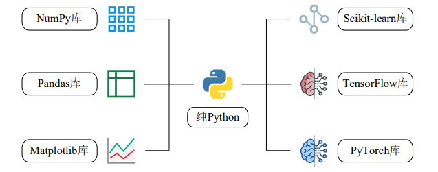
> </div> 
> 
> ① NumPy 包为 Python 加上了关键的数组变量类型，弥补了 Python 的不足；
> ② Pandas 包在 NumPy 数组的基础上添加了与 Excel 类似的行列标签；
> ③ Matplotlib 库借鉴 Matlab，帮 Python 具备了绘图能力，使其如虎添翼；
> ④ Scikit-learn 库是机器学习库，内含分类、回归、聚类、降维等多种算法；
> ⑤ TensorFlow 库是 Google 公司开发的深度学习框架，于 2015 年问世；
> ⑥ PyTorch 库是 Facebook 公司开发的深度学习框架，于 2017 年问世。
> 
> 
> ⚫ 人工智能是一个很大的概念，其中一个最重要的分支就是机器学习；
> ⚫ 机器学习的算法多种多样，其中最核心的就是神经网络；
> ⚫ 神经网络的隐藏层若足够深，就被称为深层神经网络，也即深度学习；
> ⚫ 深度学习包含深度神经网络、卷积神经网络、循环神经网络等。
> 
> 

### 虚拟环境

> 
> PyTorch 为 1.12.0 
>
> Python 为 3.9
>
> NumPy 为 1.21 版本
> 
> Pandas 为 1.2.4 版本
> 
> Matplotlib 为 3.5.1 版本；
>
> 
> > ```sh
> > # 列出所有的环境
> > conda env list
> > 
> > # 进入名为“DL”的虚拟环境
> > conda activate DL
> > ```
> > 
> > 
> > 虚拟环境内的操作 (其实之前已经安装好了)
> > 
> > ```sh
> > # 列出当前环境下的所有库
> > conda list
> > 
> > # 安装 numpy 1.21.5版 
> > conda install numpy==1.21.5
> > # 查看版本
> > pip show numpy 
> > 
> > # 安装 Pandas 1.2.4 版本
> > conda install pandas==1.2.4
> > # 查看版本
> > pip show pandas
> > 
> > # 安装 Matplotlib 3.5.1 版本；
> > conda install matplotlib==3.5.1
> > # 查看版本
> > pip show matplotlib 
> > 
> > # 退出虚拟环境
> > conda deactivate
> > ```
> > 
> 
> 
> 


### 一、张量

#### 1.1 数组与张量

> 
> <font color="yellow"> `NumPy` 和 `PyTorch` 的基础语法几乎一致</font> ，具体表现为：
> 
> > * `np` 对应 `torch`；
> > * 数组 `array` 对应张量 `tensor`；
> > * `NumPy` 的 `n` 维数组对应着 `PyTorch` 的 `n` 阶张量。
> 
> <font color="yellow">数组与张量之间可以相互转换：</font>
> 
> > * 数组 `arr` 转为张量 `ts`：`ts = torch.tensor(arr)`
> > * 张量 `ts` 转为数组 `arr`：`arr = np.array(ts)`
> 
> 


#### 1.2 从数组到张量

> 
> `PyTorch` 只是少量修改了 `NumPy` 的函数或方法
> 
> <div align=center>
> 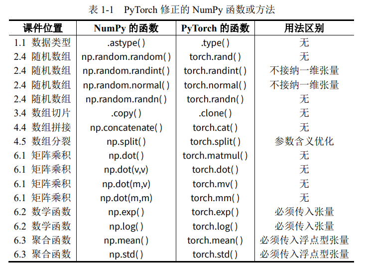
> </div> 
> 
> 


#### 1.3 用 GPU 存储张量

> Jupyter 上运行如下代码
> 
> <div align=center>
> 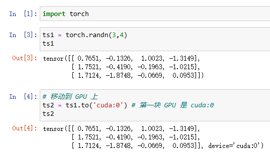
> </div> 
>  
> Pycharm 上运行如下代码
> 
> <div align=center>
> 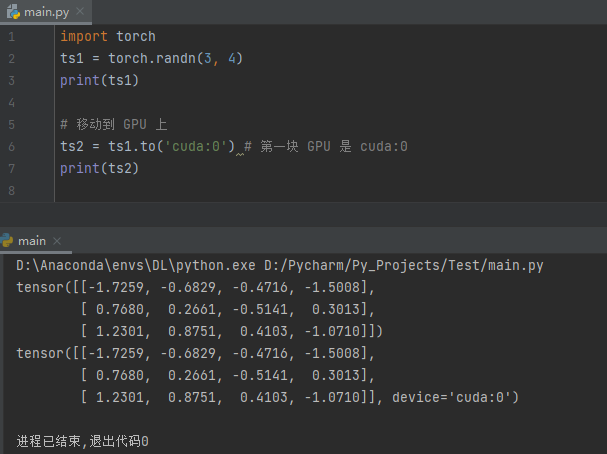
> </div> 
>  
> <font color="yellow">以上操作可以把数据集搬到 `GPU` 上，但是神经网络模型也要搬到 `GPU` 上才可正常运行，使用下面的代码即可。</font>
> 
> <div align=center>
> 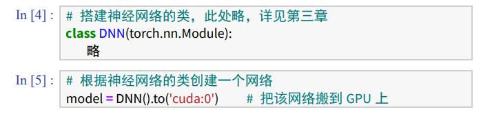
> </div> 
>  
> 想要查看显卡是否在运作时，在 `cmd` 中输入：`nvidia-smi`，如图所示。
> 
> <div align=center>
> 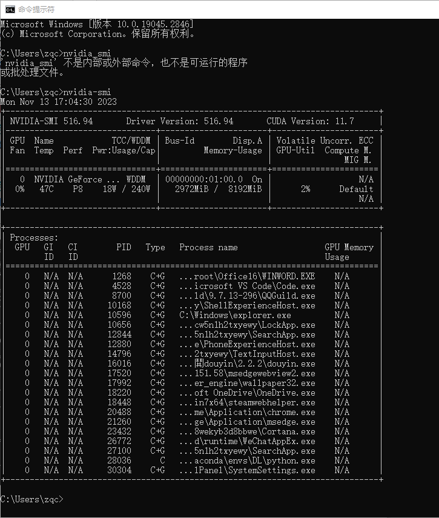
> </div> 
> 
> 
> 
> 
> 


### 二、DNN 的原理

>
> 神经网络可以分为这么几步：
> 
> 1. 划分数据集
> 2. 训练网络
> 3. 测试网络
> 4. 使用网
> 

#### 2.1 划分数据集

> 
> <font color="yellow">数据集里每个样本必须包含输入与输出，将数据集按一定的比例划分为训练集与测试集，分别用于训练网络与测试网络</font>
> 
> <div align=center>
> 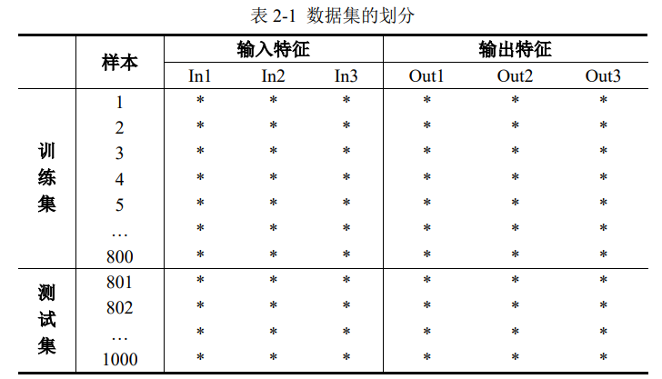
> </div> 
> 
> 考虑到数据集的输入特征与输出特征都是 `3` 列，因此神经网络的输入层与输出层也必须都是 `3` 个神经元，隐藏层可以自行设计，如图所示
> 
> <div align=center>
> 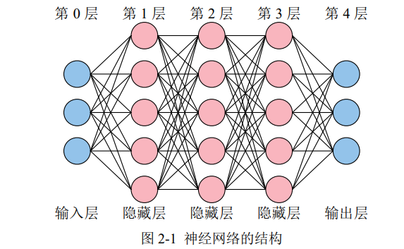
> </div> 
> 
> 考虑到 `Python 列表`、`NumPy 数组`以及 `PyTorch 张量`都是从`索引[0]`开始，再加之输入层没有内部参数（权重 ω 与偏置 b），所以习惯将`输入层`称之为`第 0 层`。
>
> 所以上图中的神经网络只有4层，不包含输入层
> 
> 


#### 2.2 训练网络

> `训练 = 拟合复杂函数`
> 
> 神经网络的训练过程，就是经过很多次前向传播与反向传播的轮回，最终不断调整其`内部参数`（权重 ω 与偏置 b），以拟合任意复杂函数的过程。内部参数一开始是随机的（如 Xavier 初始值、He 初始值），最终会不断优化到最佳。
>
> 还有一些训练网络前就要设好的`外部参数`：网络的层数、每个隐藏层的节点数、每个节点的激活函数类型、学习率、轮回次数、每次轮回的样本数等等。
> 
> <font color="gree">业界习惯把内部参数称为参数，外部参数称为超参数。</font>
> 
> <font color="pink">（1）前向传播 </font>
>
> > 将单个样本的 3 个输入特征送入神经网络的输入层后，神经网络会逐层计算到输出层，最终得到神经网络预测的 3 个输出特征。
> > 
> > 计算过程中所使用的参数就是内部参数，所有的隐藏层与输出层的神经元都有内部参数，以第 1 层的第 1 个神经元，如图所示。
> > 
> > <div align=center>
> > 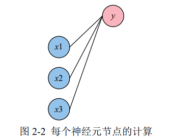
> > </div> 
> > 
> > 该神经元节点的计算过程为 $y = \omega_1 x_1 + \omega_2 x_2 + \omega_3 x_3 + b$ 。
> > 
> > 你可以理解为，每一根线就是一个权重 $\omega$，每一个神经元节点也都有它自己的偏置 $b$。
> > 
> > 当然，每个神经元节点在计算完后，由于这个方程是线性的，因此必须在外面套一个非线性的函数：$y = \sigma \left(  \omega_1 x_1 + \omega_2 x_2 + \omega_3 x_3 + b  \right)$
> > 
> > $\sigma$ 被称为激活函数。
> > 
> > 如果你不套非线性函数，那么即使 10 层的网络，也可以用 1 层就拟合出同样的方程，如下图所示
> > 
> > <div align=center>
> > 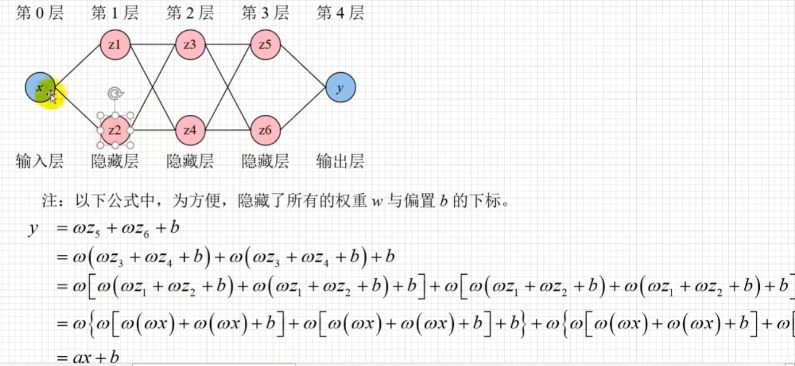
> > </div> 
> > 
> > 
>
> 
> 
> <font color="pink">（2）反向传播 </font>
>
> > 经过前向传播，网络会根据当前的内部参数计算出输出特征的预测值。但是这个预测值与真实值直接肯定有差距，因此需要一个损失函数来计算这个差距。例如，求预测值与真实值之间差的绝对值，就是一个典型的损失函数。
> >  
> > <font color="yellow">损失函数计算好后，逐层退回求梯度，这个过程很复杂，原理不必掌握，大致意思就是，看每一个内部参数是变大还是变小，才会使得损失函数变小。这样就达到了优化内部参数的目的。</font>
> > 
> > <font color="gree">在这个过程中，有一个`外部参数`叫`学习率`。学习率越大，内部参数的优化越快，但过大的学习率可能会使损失函数越过最低点，并在谷底反复横跳。因此，在网络的训练开始之前，选择一个合适的学习率很重要。</font>
> > 
> > 
> 
> <font color="pink">（3）batch_size </font>
>
> > 前向传播与反向传播一次时，有三种情况：
> > 
> > > * `批量梯度下降`（Batch Gradient Descent，`BGD`），把所有样本一次性输入进网络，这种方式计算量开销很大，速度也很慢。
> > > 
> > > * `随机梯度下降`（Stochastic Gradient Descent，`SGD`），每次只把一个样本输入进网络，每计算一个样本就更新参数。这种方式虽然速度比较快，但是收敛性能差，可能会在最优点附近震荡，两次参数的更新也有可能抵消。
> > > 
> > > * `小批量梯度下降`（Mini-Batch Gradient Decent，`MBGD`）是为了中和上面二者而生，这种办法把样本划分为若干个批，按批来更新参数。
> > 
> > 所以，`batch_size` 即一批中的样本数，也是一次喂进网络的样本数。此外，由于 `Batch Normalization` 层（用于将每次产生的小批量样本进行标准化）的存在，`batch_size` 一般设置为 `2` 的幂次方，并且不能为 `1`。
> > 
> > <font color="yellow">注：PyTorch 实现时只支持批量`BGD`与小批量`MBGD`，不支持单个样本的输入方式。`PyTorch` 里的 `torch.optim.SGD` 只表示梯度下降
> > 
> > <font color="gree">批量与小批量见第四、五章。</font>
> > 
> > 
> 
> <font color="pink">（4）epochs </font>
>
> > `1` 个 `epoch` 就是指全部样本进行 `1` 次前向传播与反向传播。
>
> 
> <font color="pink">（5）假设有 `10240` 个训练样本，`batch_size` 是 `1024`，`epochs` 是 `5`。那么： </font>
> 
> > * 全部样本将进行 `5` 次前向传播与反向传播；
> > * `1` 个 `epoch`，将发生 `10` 次（ `10240 ÷ 102`4 ）前向传播与反向传播；
> > * 一共发生 `50` 次（`10 × 5`）前向传播和反向传播
> 
> 
> 
> 
> 


#### 2.3 测试网络

> 
> 为了防止训练的网络过拟合，因此需要拿出少量的样本进行测试。过拟合的意思是：网络优化好的内部参数只能对训练样本有效，换成其它就寄。以线性回归为例，过拟合如图 2-3（b）所示。
> > 
> > <div align=center>
> > 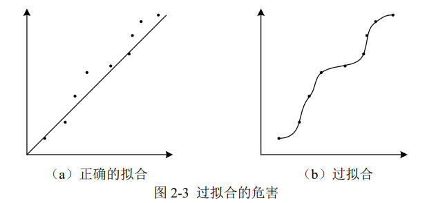
> > </div> 
> > 
> 
> 当网络训练好后，拿出测试集的输入，进行 1 次前向传播后，将预测的输出与测试集的真实输出进行对比，查看准确率。
> 
> 


#### 2.4 使用网络

> 
> 真正使用网络进行预测时，样本只知输入，不知输出。直接将样本的输入进行 `1` 次前向传播，即可得到预测的输出
> 
> 


### 三、DNN 的实现


> 
> <font color="pink">`torch.nn` 提供了搭建网络所需的所有组件，`nn` 即 `Neural Network` 神经网络。因此，可以单独给 `torch.nn` 一个别名，即 `import torch.nn as nn`。</font>
> > 
> > <div align=center>
> > 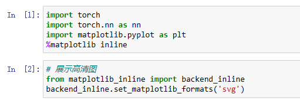
> > </div> 
> > 
> > <font color="yellow">含有`inline`的行属于`Jupyter`独有,使用`Pycharm`请删除`inline`行</font>
> > 
> > <div align=center>
> > 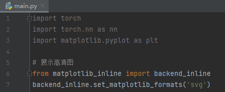
> > </div> 
> > 
> > 
> > `Jupyter Notebook` 代码如下：
> > 
> > ```python
> > import torch
> > import torch.nn as nn
> > import matplotlib.pyplot as plt
> > %matplotlib inline 
> > 
> > # 展示高清图
> > from matplotlib_inline import backend_inline
> > backend_inline.set_matplotlib_formats('svg') # 使用svg格式显示绘图
> > # 指定matplotlib输出svg图表以获得更清晰的图像
> > ```
> > 
> > 
> > `Pycharm` 代码如下：
> > 
> > ```python
> > import torch
> > import torch.nn as nn
> > import matplotlib.pyplot as plt
> > # %matplotlib inline # Jupyter才需要
> > 
> > # 展示高清图
> > from matplotlib_inline import backend_inline
> > backend_inline.set_matplotlib_formats('svg') # 使用svg格式显示绘图
> > # 指定matplotlib输出svg图表以获得更清晰的图像
> > ```
> > 
> > <font color="gree">上面的代码语句是固定的，记住即可</font>
>
> > 注：
> > 
> > 使用`Jupyter Notebook`，需要先运行 `Jupyter Notebook` 的魔术命令`%matplotlib inline`。这条命令的作用是将 `Matplotlib` 绘制的图形嵌入在当前页面中。而在桌面环境中绘图时，不需要添加此命令，而是在全部绘图代码之后追加`plt.show()`
> > 
> 


#### 3.1 制作数据集

> 
> <font color="pink">在训练之前，要准备好训练集的样本。</font>
> 
> > 这里生成 `10000` 个样本，设定 `3` 个输入特征与 `3` 个输出特征，其中
> > 
> > * 每个输入特征相互独立，均服从均匀分布；
> > * 当 `(X1+X2+X3)< 1` 时，`Y1` 为 `1`，否则 `Y1` 为 `0`；
> > * 当 `1<(X1+X2+X3)<2` 时，`Y2` 为 `1`，否则 `Y2` 为 `0`；
> > * 当 `(X1+X2+X3)>2` 时，`Y3` 为 `1`，否则 `Y3` 为 `0`；
> > * `.float()`将布尔型张量`bool tensor`转化为浮点型张量`float tensor`。
> > 
> > 
> > 
> > `Jupyter Notebook` 代码如下：
> > 
> > ```python
> > # 生成数据集
> > X1 = torch.rand(10000,1) # 输入特征 1
> > X2 = torch.rand(10000,1) # 输入特征 2
> > X3 = torch.rand(10000,1) # 输入特征 3
> > Y1 = ( (X1+X2+X3)<1 ).float() # 输出特征 1
> > Y2 = ( (1<(X1+X2+X3)) & ((X1+X2+X3)<2) ).float() # 输出特征 2
> > Y3 = ( (X1+X2+X3)>2 ).float() # 输出特征 3
> > Data = torch.cat([X1,X2,X3,Y1,Y2,Y3],axis=1) # 整合数据集
> > Data = Data.to('cuda:0') # 把数据集搬到 GPU 上
> > Data.shape
> > ```
> > 
> > 
> > `Pycharm` 代码如下：
> > 
> > ```python
> > # 生成数据集
> > X1 = torch.rand(10000, 1)  # 输入特征 1
> > X2 = torch.rand(10000, 1)  # 输入特征 2
> > X3 = torch.rand(10000, 1)  # 输入特征 3
> > print(X1.shape, X2.shape, X3.shape)  # torch.Size([10000, 1]) torch.Size([10000, 1]) torch.Size([10000, 1])
> > 
> > Y1 = ((X1+X2+X3) < 1).float()  # 输出特征 1
> > Y2 = ((1 < (X1+X2+X3)) & ((X1+X2+X3) < 2)).float()  # 输出特征 2
> > Y3 = ((X1+X2+X3) > 2).float()  # 输出特征 3
> > print(Y1.shape, Y2.shape, Y3.shape)  # torch.Size([10000, 1]) torch.Size([10000, 1]) torch.Size([10000, 1])
> > 
> > Data = torch.cat([X1, X2, X3, Y1, Y2, Y3], axis=1)  # 整合数据集; cat就是numpy中的concatenate
> > print(Data.type())  # torch.FloatTensor
> > 
> > Data = Data.to('cuda:0')  # 把数据集搬到 GPU 上
> > print(Data.type())  # torch.cuda.FloatTensor
> > print(Data.shape)  # torch.Size([10000, 6])
> > ```
> > 
> 
> <font color="pink">然后划分训练集与测试集</font>
> 
> > <font color="yellow">以下代码属于通用型代码，便于我们手动分割训练集与测试集</font>
> > 
> > 
> > `Jupyter Notebook` 代码如下：
> > 
> > ```python
> > # 划分训练集与测试集
> > train_size = int(len(Data) * 0.7) # 训练集的样本数量
> > test_size = len(Data) - train_size # 测试集的样本数量
> > Data = Data[torch.randperm( Data.size(0)) , : ] # 打乱样本的顺序
> > train_Data = Data[ : train_size , : ] # 训练集样本
> > test_Data = Data[ train_size : , : ] # 测试集样本
> > train_Data.shape, test_Data.shape
> > ```
> > 
> > 
> > `Pycharm` 代码如下：
> > 
> > ```python
> > # 划分训练集与测试集
> > train_size = int(len(Data) * 0.7)  # 训练集的样本数量
> > test_size = len(Data) - train_size  # 测试集的样本数量
> > Data = Data[torch.randperm(Data.size(0)), :]  # 打乱样本的顺序
> > train_Data = Data[:train_size, :]  # 训练集样本
> > test_Data = Data[train_size:, :]  # 测试集样本
> > print(train_Data.shape, test_Data.shape)  # torch.Size([7000, 6]) torch.Size([3000, 6])
> > ```
> > 
> 
> 
> 
> 
> <font color="pink">注：`One-Hot` 编码</font>
> 
> > 事实上，数据的 `3` 个输出特征组合起来是一个 `One-Hot 编码`（独热编码）。
> > 
> > 举例说明
> > 
> > 假如有三种颜色特征：红、黄、蓝。 在利用机器学习的算法时一般需要进行向量化或者数字化。那么你可能想令 `红=1，黄=2，蓝=3`. 那么这样其实实现了标签编码，即给不同类别以标签。然而这意味着机器可能会学习到 “红 < 黄 < 蓝”，但这并不是我们的让机器学习的本意，只是想让机器区分它们，并无大小比较之意。所以这时标签编码是不够的，需要进一步转换。因为有三种颜色状态，所以就有`3 bit`。即 `红色：1 0 0 ，黄色: 0 1 0，蓝色：0 0 1` 。如此一来每两个向量之间的距离都是 $\sqrt{2}$，在向量空间距离都相等，所以这样不会出现偏序性，基本不会影响基于向量空间度量算法的效果
> > 
> > `One-Hot` 编码是一种在机器学习和数据处理中常用的技术，特别是在处理分类数据时。这种方法将分类变量转换为一种形式，使得可以用二进制来表示每一个类别。
> > 
> > `One-Hot` 编码的基本原理和步骤如下：
> > 
> > 1. **确定类别数量**：首先，确定你的数据中有多少个不同的类别。例如，如果你有一个包含“苹果”，“香蕉”，和“橘子”的水果类别数据，那么你有三个类别。
> > 
> > 2. **创建二进制特征**：对于每一个类别，创建一个新的二进制特征（列）。每个特征对应一个类别。在我们的例子中，你会创建三个新特征：一个代表“苹果”，一个代表“香蕉”，一个代表“橘子”。
> > 
> > 3. **编码**：对于数据集中的每个实例，根据它属于哪个类别，在相应的特征列上标记为1，其余列标记为0。例如，如果一个数据实例是“香蕉”，那么“香蕉”列将被标记为1，而“苹果”和“橘子”列将被标记为0。
> > 
> > 4. **结果**：最终，每个实例都将通过一系列的0和1来表示，这些0和1标识了它属于哪个类别。
> > 
> > One-Hot 编码的主要优点是它可以使模型更容易处理和理解分类数据。然而，当类别数量非常多时，这种编码方法可能导致数据维度的显著增加，这种情况下可能需要考虑其他编码技术，如嵌入式编码。
> > 
> > 
> 
> 
> 
> <font color="pink">可以直接看数据</font>
> 
> > <div align=center>
> > 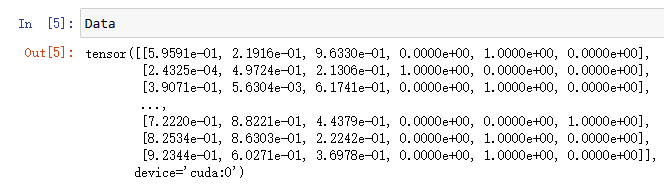
> > </div> 
> 
> 
> 


#### 3.2 搭建神经网络

> 
> <font color="pink">搭建神经网络时，以 `nn.Module` 作为父类，我们自己的神经网络可直接继承父类的方法与属性，`nn.Module` 中包含网络各个层的定义。</font>
> 
> 在定义的神经网络子类中，通常包含 `__init__` 特殊方法与 `forward` 方法。
> 
> > `__init__` 特殊方法用于构造自己的神经网络结构，
> > 
> > `forward` 方法用于将输入数据进行前向传播。由于张量可以自动计算梯度，所以不需要出现反向传播方法。
> > 
> 
> > 
> > `Jupyter Notebook` 代码如下：
> > 
> > ```python
> > # 代码块1
> > class DNN(nn.Module):
> >     def __init__(self):
> >         ''' 搭建神经网络各层 '''
> >         super(DNN,self).__init__()
> >         self.net = nn.Sequential( # 按顺序搭建各层
> >         nn.Linear(3, 5), nn.ReLU(), # 第 1 层：全连接层
> >         nn.Linear(5, 5), nn.ReLU(), # 第 2 层：全连接层
> >         nn.Linear(5, 5), nn.ReLU(), # 第 3 层：全连接层
> >         nn.Linear(5, 3) # 第 4 层：全连接层
> >         )
> >     def forward(self, x):
> >         ''' 前向传播 '''
> >         y = self.net(x) # x 即输入数据
> >         return y # y 即输出数据
> > 
> > # 代码块2
> > model = DNN().to('cuda:0') # 创建子类的实例，并搬到 GPU 上
> > model # 查看该实例的各层
> > ```
> > 
> > 
> > `Pycharm` 代码如下：
> > 
> > ```python
> > class DNN(nn.Module):
> >     def __init__(self):
> >         ''' 搭建神经网络各层 '''
> >         super(DNN, self).__init__()
> >         self.net = nn.Sequential(    # 按顺序搭建各层
> >         nn.Linear(3, 5), nn.ReLU(),  # 第 1 层：全连接层
> >         nn.Linear(5, 5), nn.ReLU(),  # 第 2 层：全连接层
> >         nn.Linear(5, 5), nn.ReLU(),  # 第 3 层：全连接层
> >         nn.Linear(5, 3)              # 第 4 层：全连接层
> >         )
> > 
> >     def forward(self, x):
> >         ''' 前向传播 '''
> >         y = self.net(x)  # x 即输入数据, 这里的net和__init__()中的net要一致，自己起名
> >         return y         # y 即输出数据
> > 
> > 
> > model = DNN().to('cuda:0')  # 创建子类的实例，并搬到 GPU 上
> > print(model)                # 查看该实例的各层
> > ```
> > 
> > 
> > <div align=center>
> > 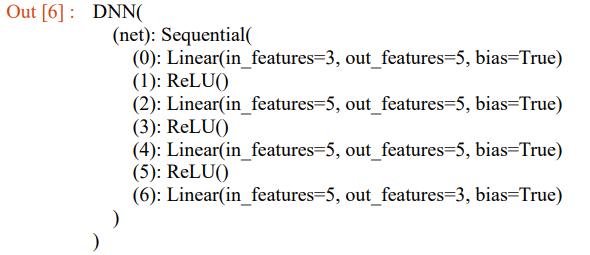
> > </div> 
> > 
> > 在上面的 `nn.Sequential()` 函数中，每一个隐藏层后都使用了 `RuLU` 激活函数，各层的神经元节点个数分别是：`3、5、5、5、3`
> > 
> > 注意，输入层有 `3` 个神经元、输出层有 `3` 个神经元，这不是巧合，是有意而为之。输入层的神经元数量必须与每个样本的输入特征数量一致，输出层的神经元数量必须与每个样本的输出特征数量一致
> > 
>
> 
> <font color="pink">注：各种库函数的意义</font>
> 
> >  `super(Net, self).__init__()`
> > 
> > > 参考： https://www.cnblogs.com/lusiqi/p/17202800.html
> > > 
> > > `super()` 函数是用来调用父类（超类）的一个方法。这里的 `Net` 是当前类的名称，`self` 是对当前实例的引用。
> > > 
> > > 子类 `class Net` 继承父类 `class nn.Module`, `super(Net,self).__init__()` 就是对继承自父类 `nn.Module` 的属性进行初始化。并且是用 `nn.Module` 的初始化方法来初始化继承的属性。
> > > 
> > > 也就是：用父类的方法初始化子类的属性。
> > > 
> > > 为啥要用父类的方法去初始化属性呢？原因很简单：因为父类的方法已经写好了，我们只需要调用就可以了。
> > > 
> > > `python` 中创建类后，通常会创建一个 `__init__()` 方法，这个方法会在创建类的实例的时候自动执行。类似于C++中的构造函数。
> > 
> > `nn.Sequential()`
> > 
> > > 
> > > `nn.Sequential()` 用于将多个模块按顺序封装成一个单独的模块。
> > > 
> > > 理解 `nn.Sequential()` 的关键点如下：
> > > 
> > > 1. **简化模型定义**：通常，当你使用 `PyTorch` 创建一个神经网络时，你需要定义一个 `forward` 方法，该方法明确指定了数据在网络中的传播路径。使用 `nn.Sequential()`，你可以避免编写自己的 `forward` 方法，因为 `nn.Sequential` 会自动按照添加模块的顺序来处理数据流。
> > > 
> > > 2. **按顺序排列层和函数**：在 `nn.Sequential()` 容器中，你可以按顺序添加网络层、激活函数等组件。当输入数据传递给一个 `nn.Sequential` 模型时，数据会依次经过这些层和函数。
> > > 
> > > 3. **易于修改和扩展**：如果你的网络结构是一系列顺序操作，使用 `nn.Sequential()` 会使得修改层和其他元素变得更加简单，因为你只需要添加或删除 `nn.Sequential()` 中的元素即可。
> > > 
> > > 
> > 
> > 
> > `nn.Linear()`
> > 
> > > `nn.Linear(3, 5)` 实际上是 `nn.Linear(in_features=3, out_features=5)`
> > > 
> > > 
> > > 
> > > 
> > > 
> 
> 


#### 3.3 网络的内部参数

> 
> 


